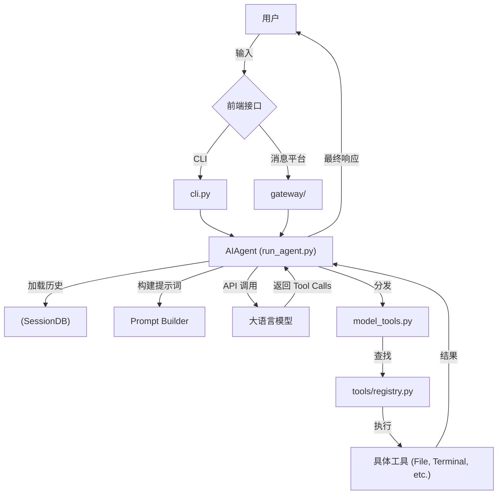

# Hermes Agent 架构分析

本文档深入分析了 Hermes Agent 的核心架构，并重点关注其强化学习 (RL) 模块和技能 (Skills) 自学习特性的设计与实现。

## 1. 全局架构

Hermes Agent 是一个高度模块化、基于工具调用（Tool-calling）循环的智能体系统。其核心设计理念是将大语言模型（LLM）的推理能力与外部工具（如文件操作、终端、浏览器等）紧密结合，并通过不同层级的封装实现跨平台（CLI、网关、测试）的一致性。

### 1.1 核心组件

#### AIAgent (`run_agent.py`)
`AIAgent` 类是整个系统的“大脑”，负责管理对话状态和执行推理循环。

- **核心入口**: `run_conversation` 方法处理用户请求，是一个复杂的自适应循环。
- **上下文管理**: 动态加载会话历史，支持上下文压缩以防止超出 Token 限制。
- **系统提示词**: 动态组装，包含核心指令、环境上下文（如 `AGENTS.md`）和记忆。
- **推理循环**:
    - 调用 LLM API（支持 Anthropic Prompt Caching）。
    - 处理 `tool_calls`，分发工具执行。
    - 处理中断和预算控制。

#### 前端交互层 (`cli.py` & `gateway/`)
这两个模块是 Agent 的不同前端实现，均通过实例化 `AIAgent` 工作。

- **CLI (`cli.py`)**:
    - 基于 `Rich` 和 `prompt_toolkit` 提供交互式终端 UI。
    - 维护长连接会话，状态持久化在本地 `SessionDB` (`hermes_state.py`)。
    - 提供 `thinking_callback`（思考动画）和 `clarify_callback`（确认交互）。
- **Gateway (`gateway/`)**:
    - 适配 Telegram, Discord, Slack 等消息平台。
    - 处理无状态/短连接交互，通常为每个请求临时实例化 `AIAgent`。
    - 包含媒体处理和自动记忆刷新机制。

#### 工具系统 (`model_tools.py` & `tools/registry.py`)
采用**去中心化注册、中心化分发**的架构。

- **注册表 (`tools/registry.py`)**: 单例模式，存储工具 Schema、Handler 和权限检查函数。每个工具文件在导入时自注册。
- **分发层 (`model_tools.py`)**:
    - `_discover_tools()` 动态加载工具模块。
    - `handle_function_call` 统一分发工具调用，处理异常并返回标准 JSON。

### 1.2 架构交互图

## 2. 强化学习 (RL) 架构

Hermes Agent 的 RL 模块基于 **Tinker-Atropos** 框架，旨在通过与真实环境（如终端、浏览器）交互并获得奖励来优化智能体的决策能力。

### 2.1 核心组件

- **环境基类 (`environments/hermes_base_env.py`)**:
    - 定义了与 Atropos 框架对接的标准接口 (`setup`, `get_next_item`, `compute_reward`)。
    - 支持 **Phase 1** (OpenAI 兼容模式) 和 **Phase 2** (VLLM 托管模式，支持 Token 级对齐)。
    - 使用沙盒（Docker/Modal）隔离每个训练任务。
- **Agent Loop (`environments/agent_loop.py`)**:
    - 模拟主程序的 `run_agent.py` 逻辑，但在 RL 训练环境中运行。
    - 负责多轮对话和工具调用的执行，并将轨迹数据反馈给训练器。
- **训练管理工具 (`tools/rl_training_tool.py`)**:
    - 允许 Agent 自我启动和监控 RL 训练。
    - 编排三个关键进程：`run-api` (轨迹 API), `launch_training.py` (训练器), 环境服务进程。
- **具体环境 (`environments/hermes_swe_env/hermes_swe_env.py`)**:
    - 针对软件工程任务的实现。
    - 将任务描述转化为 Prompt，通过在沙盒中运行测试用例计算奖励。

### 2.2 训练循环与生命周期

1.  **配置**: 选择环境，调整超参数。
2.  **启动**: 启动 API Server, Inference Server (带 LoRA), Environment Server。
3.  **迭代**:
    - **轨迹收集**: 环境服务器请求任务，Agent Loop 在沙盒中执行任务，生成轨迹。
    - **奖励计算**: 任务完成后，环境运行验证脚本计算奖励 (0.0 - 1.0)。
    - **权重更新**: 训练器根据轨迹和奖励计算损失，更新模型权重。
4.  **监控**: 通过 WandB 记录指标，Agent 可通过工具查询进度。

## 3. Skills 自学习系统

Hermes Agent 将技能 (Skills) 视为其**程序化记忆 (Procedural Memory)**，通过一套闭环系统实现技能的发现、固化和应用。

### 3.1 技能管理 (`tools/skill_manager_tool.py`)

这是 Agent 实现“自学习”的核心工具，允许 Agent 对技能进行 CRUD 操作：
- **Create**: 创建新技能，生成 `SKILL.md`（含 YAML 元数据和 Markdown 指令）。
- **Patch**: 推荐方式，通过字符串替换局部更新技能。
- **Edit**: 全量覆盖，用于重构。
- **触发机制**:
    - 复杂任务成功（工具调用 > 5 次）。
    - 错误修正（多次失败后成功）。
    - 发现非平凡工作流。
    - 用户显式纠正。

### 3.2 加载与执行 (`agent/skill_commands.py`)

- **动态扫描**: 系统启动时扫描 `~/.hermes/skills/`，将文件名映射为斜杠命令。
- **渐进式披露**:
    - 系统提示词仅包含简短索引。
    - 仅当用户调用命令或 Agent 主动查看时，才将完整技能内容注入上下文。
- **环境适配**: 根据技能元数据中的 `platforms` 字段过滤不兼容的技能。

### 3.3 自动化与闭环

- **系统 Nudging**: `run_agent.py` 会监控长任务，若发现可复用工作流，会在下一轮对话中提示 Agent 考虑创建技能。
- **文档生成**: 支持从外部 Agent 定义（如 LobeHub）或官方文档自动生成技能。
- **自我修正**: 当技能失效时，Agent 被鼓励使用 `skill_manage(action='patch')` 进行自我修复。

---

**总结**: Hermes Agent 通过高度模块化的架构实现了灵活的扩展性，利用 RL 模块实现基于真实环境反馈的能力提升，并通过 Skills 系统实现了经验的积累和自我进化。
