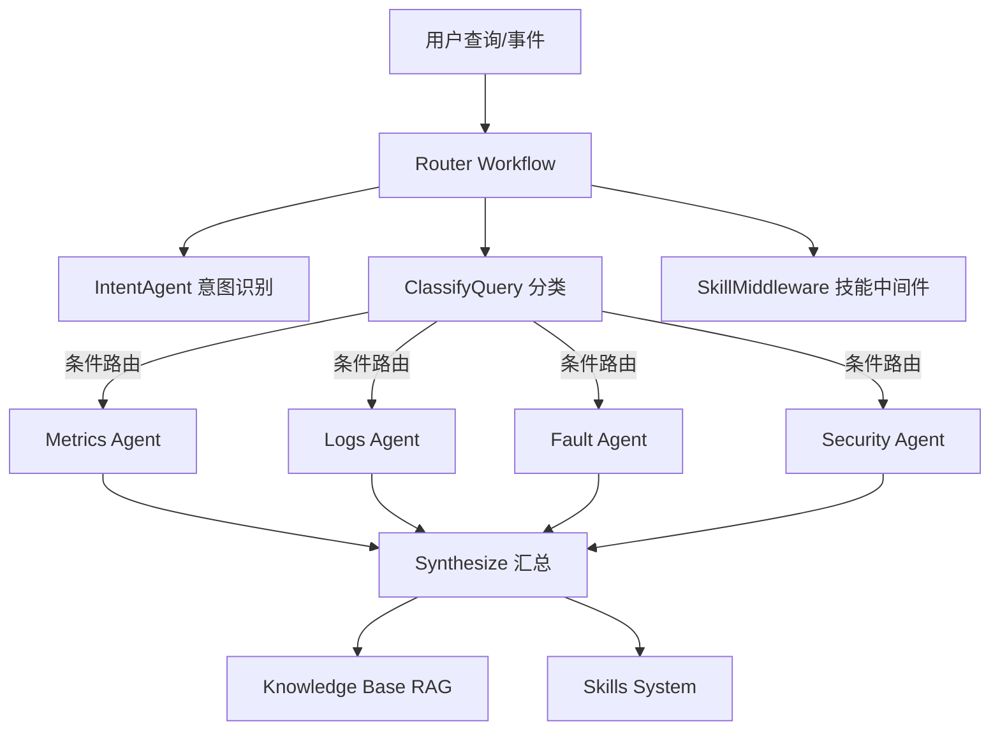
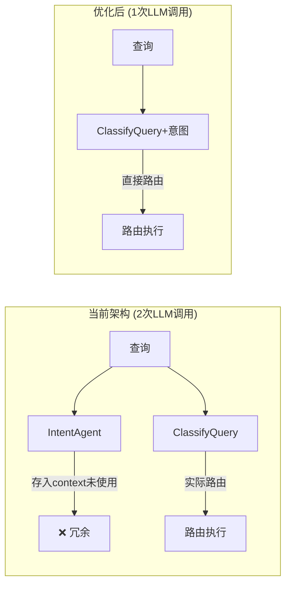

# AIOps 项目架构优化建议

本文档基于对项目现有架构的深入分析，提出了一系列优化建议，旨在提升系统的可维护性、性能、安全性和可观测性。

**文档版本**: v1.1
**分析日期**: 2026-03-13
**最后更新**: 2026-03-13
**分析范围**: 核心架构、配置管理、技能系统、安全增强、性能优化、可观测性

### 变更记录

- **v1.1** (2026-03-13): 新增 2.3 "意图识别与路由分类重复" 优化建议
- **v1.0** (2026-03-13): 初始版本

***

## 1. 项目架构评估

### 1.1 架构优势

| 维度         | 评分    | 说明                                                |
| ---------- | ----- | ------------------------------------------------- |
| **模块化设计**  | ⭐⭐⭐⭐  | 清晰的分层结构：agents/workflows/skills/tools             |
| **可扩展性**   | ⭐⭐⭐⭐⭐ | 动态技能系统、插件化架构                                      |
| **技术栈先进性** | ⭐⭐⭐⭐⭐ | LangChain + LangGraph + ChromaDB + LiteLLM        |
| **容器化部署**  | ⭐⭐⭐⭐  | 完整的 Docker Compose 编排                             |
| **可观测性**   | ⭐⭐⭐⭐⭐ | LangSmith 集成 + 监控栈 (Prometheus/VictoriaLogs/OTEL) |

### 1.2 核心架构模式

当前系统采用基于 LangGraph 的路由模式，实现了多智能体协作：



***

## 2. 架构问题与优化建议

### 2.1 配置管理混乱 \[P0]

#### 问题描述

当前系统中存在两套配置前缀，导致维护困难：

```bash
# .env.example 中存在不一致的配置
APP_ENVIRONMENT=development        # 旧版配置
AIOPS_ENVIRONMENT=dev              # 新版配置
APP_HOST=0.0.0.0                   # 旧版配置
```

#### 影响分析

- 维护成本高，不知道应该使用哪套配置
- 容易产生配置冲突
- 新开发者上手困难

#### 优化方案

1. **统一配置前缀**

```python
# aiops/config/settings.py
class ConfigPrefix:
    """统一配置前缀常量"""
    AIOPS = "AIOPS_"
    DELIMITER = "__"

# 废弃的配置前缀（标记为 @deprecated）
APP_ENV = "APP_"  # @deprecated use AIOPS_ instead
```

1. **添加配置验证层**

```python
# aiops/config/validator.py
from pydantic import ValidationError
from typing import Dict, Any

class ConfigValidator:
    """配置验证器，确保配置的正确性和一致性"""

    def validate(self, settings: Settings) -> ValidationResult:
        """验证配置的有效性"""
        issues = []

        # 检查必需的配置项
        if not settings.metrics.prometheus_base_url:
            issues.append("metrics.prometheus_base_url is required")

        # 检查URL格式
        self._validate_urls(settings, issues)

        # 检查阈值范围
        self._validate_thresholds(settings, issues)

        return ValidationResult(
            is_valid=len(issues) == 0,
            issues=issues
        )
```

1. **配置迁移指南**

```markdown
# 迁移步骤

1. 备份现有 `.env` 文件
2. 将所有 `APP_*` 配置迁移到 `AIOPS_*`
3. 添加配置验证到启动流程
4. 在代码中添加废弃警告
```

**预计工作量**: 2 天
**影响范围**: 全局配置

***

### 2.2 技能系统重复注册 \[P1]

#### 问题描述

在 `router_workflow.py:428-432` 中，每次工作流执行都重新注册技能：

```python
# 当前实现 - 每次执行都创建新实例
def skill_orchestration_node(state: RouterState) -> dict:
    registry = SkillRegistry()  # ❌ 每次创建新实例
    registry.bulk_register(PROMETHEUS_SKILLS)
    registry.bulk_register(VICTORIALOGS_SKILLS)
    # ...
```

#### 影响分析

- 重复初始化浪费 CPU 和内存资源
- 无状态设计无法追踪技能使用情况
- 无法实现技能的热更新
- 不支持技能执行统计

#### 优化方案

1. **实现单例模式的应用级技能注册表**

```python
# aiops/skills/global_registry.py
from threading import Lock
from typing import Optional

class GlobalSkillRegistry:
    """全局单例技能注册表"""

    _instance: Optional['GlobalSkillRegistry'] = None
    _lock = Lock()
    _initialized = False

    def __new__(cls) -> 'GlobalSkillRegistry':
        if cls._instance is None:
            with cls._lock:
                if cls._instance is None:
                    cls._instance = super().__new__(cls)
        return cls._instance

    def __init__(self):
        if not self._initialized:
            self.registry = SkillRegistry()
            self._stats = SkillExecutionStats()
            self._initialized = True

    def ensure_initialized(self) -> None:
        """确保技能已注册（懒加载）"""
        if not self._initialized:
            self._register_builtin_skills()
            self._initialized = True

    def _register_builtin_skills(self):
        """注册内置技能"""
        self.registry.bulk_register(PROMETHEUS_SKILLS)
        self.registry.bulk_register(VICTORIALOGS_SKILLS)
        self.registry.bulk_register(FAULT_DIAGNOSIS_SKILLS)
        self.registry.bulk_register(SECURITY_SKILLS)

    def record_execution(self, skill_id: str, duration_ms: int, success: bool):
        """记录技能执行统计"""
        self._stats.record(skill_id, duration_ms, success)

    def get_stats(self, skill_id: str) -> SkillStats:
        """获取技能统计信息"""
        return self._stats.get(skill_id)
```

1. **修改工作流使用全局注册表**

```python
# aiops/workflows/router_workflow.py
def skill_orchestration_node(state: RouterState) -> dict:
    global_registry = GlobalSkillRegistry()
    global_registry.ensure_initialized()

    discovery = SkillDiscoveryService(registry=global_registry.registry)
    query_text = _normalize_query(state.get("query"))
    skills = discovery.recommend_skills(query_text)
    # ...
```

**预计工作量**: 1 天
**影响范围**: 技能系统

***

### 2.3 意图识别与路由分类重复 \[P1]

#### 问题描述

当前工作流中 `IntentAgent` 和 `ClassifyQuery` 存在功能重叠：

```python
# 当前工作流 (router_workflow.py:475-477)
.add_edge("skill_middleware_pre", "intent_check")    # IntentAgent 调用
.add_edge("intent_check", "classify")                # ClassifyQuery 调用
```

**功能对比**：

| 组件                | 分类维度                                         | 输出             | 实际用途                      |
| ----------------- | -------------------------------------------- | -------------- | ------------------------- |
| **IntentAgent**   | `consultation` vs `operation`                | 意图 + 语言 + 原因   | 存入 `context` 但**从未被读取使用** |
| **ClassifyQuery** | `metrics/logs/fault/security/knowledge_base` | Agent列表 + 严重程度 | **实际路由决策**                |

#### 影响分析

1. **资源浪费**：每次查询额外调用 1 次 LLM（IntentAgent）
2. **功能冗余**：意图分类与 Agent 选择逻辑重叠
   - `consultation` → 可能用 `knowledge_base`
   - `operation` → 可能用 `metrics/logs/fault`
3. **代码冗余**：`user_intent` 存入 context 后无任何读取

#### 优化方案：合并到 ClassifyQuery

**1. 扩展** **`ClassificationResult`** **模型**

```python
# aiops/workflows/router_workflow.py
class ClassificationResult(BaseModel):
    classifications: list[Classification] = Field(
        description="Agents to invoke with targeted queries and severity level"
    )
    needs_clarification: bool = Field(
        description="True if the user query is ambiguous and needs clarification"
    )
    clarification_message: Optional[str] = Field(
        description="If needs_clarification is True, provide a polite question"
    )

    # 新增：意图信息（如果后续业务需要）
    user_intent: Optional[Literal["consultation", "operation"]] = Field(
        default=None,
        description="High-level intent: consultation (ask for info) or operation (perform action)"
    )
    user_language: Optional[Literal["zh", "en", "other"]] = Field(
        default=None,
        description="User query language for response formatting"
    )
```

**2. 移除** **`intent_check_node`**

```python
# 删除以下节点和相关代码
def intent_check_node(state: RouterState, router_llm) -> dict:
    # ... 删除整个函数

# 更新工作流构建
def build_workflow(llm, router_llm):
    graph = (
        StateGraph(RouterState)
        # 移除: .add_node("intent_check", ...)
        # 移除: .add_edge("intent_check", "classify")
        .add_edge("skill_middleware_pre", "classify")  # 直接连到 classify
        # ...
    )
```

**3. 更新** **`classify_query`** **的 Prompt**

```python
# 在现有 prompt 中添加意图检测（可选）
structured_llm = router_llm.with_structured_output(ClassificationResult)
result = structured_llm.invoke([
    {
        "role": "system",
        "content": (
            "Analyze the query and decide which AIOps agents to call. "
            "Available sources: metrics, logs, fault, security, knowledge_base. "
            "For each, produce a focused sub-query and a severity: low, medium, high, critical. "
            "Return only relevant sources. "
            "\n\nRules:"
            "\n1. Use 'knowledge_base' for queries about 'how-to', 'what is', 'policy', 'introduce', or general knowledge."
            "\n2. Use 'metrics'/'logs' for system status checks (cpu, memory, error logs)."
            "\n3. AMBIGUITY CHECK: If the query is ambiguous (e.g., 'what is my system version?'), do NOT guess. "
            "Ask for clarification: 'Do you mean the Operating System version (use tools) or the Business System version (use knowledge base)?'. "
            "Set needs_clarification=True and provide a clarification_message in the user's language."
            "\n\nOptional: If useful for downstream processing, also classify the high-level intent (consultation/operation) and language (zh/en/other)."
        ),
    },
    {"role": "user", "content": query_text},
])
```

**4. 保留** **`IntentAgent`** **类（可选）**

如果未来需要独立的意图分析能力，可以保留 `IntentAgent` 类，但从工作流中移除：

```python
# aiops/agents/intent_agent.py 保留
# 可用于 CLI 直接调用、测试、或其他场景
# 但不在 router_workflow 中使用
```

#### 架构对比



#### 收益

| 指标       | 当前    | 优化后  | 改善   |
| -------- | ----- | ---- | ---- |
| LLM 调用次数 | 2 次   | 1 次  | -50% |
| 工作流节点数   | 多 1 个 | 减少   | 简化   |
| 代码复杂度    | 高     | 低    | 更清晰  |
| 响应延迟     | \~2s  | \~1s | 更快   |

#### 实施步骤

1. 修改 `ClassificationResult` 模型
2. 更新 `classify_query` 函数的 prompt
3. 从工作流中移除 `intent_check_node`
4. 更新工作流边连接
5. 测试验证分类结果正确性
6. 保留 `IntentAgent` 类（移至 `aiops/agents/legacy/` 或添加 `@deprecated` 注释）

#### 风险评估

- **低风险**：功能合并，不改变核心逻辑
- **测试重点**：确保分类准确性不受影响
- **回滚方案**：保留 `IntentAgent` 代码，可快速恢复

**预计工作量**: 0.5 天
**影响范围**: 工作流系统

***

### 2.4 缺少中间件链机制 \[P2]

#### 问题描述

当前技能中间件直接硬编码在工作流中，无法灵活组合：

```python
# router_workflow.py
.add_node("skill_middleware_pre", skill_integration_middleware)
.add_node("skill_middleware_post", skill_solidification_middleware)
```

#### 优化方案

实现灵活的中间件链模式：

```python
# aiops/workflows/middleware_chain.py
from abc import ABC, abstractmethod
from typing import List, Callable, Any

class Middleware(ABC):
    """中间件基类"""

    @abstractmethod
    async def process(self, context: WorkflowContext, next: Callable) -> Any:
        """处理上下文并调用下一个中间件"""
        pass

class MiddlewareChain:
    """中间件链"""

    def __init__(self):
        self._middlewares: List[Middleware] = []

    def add(self, middleware: Middleware) -> 'MiddlewareChain':
        """添加中间件（支持链式调用）"""
        self._middlewares.append(middleware)
        return self

    async def execute(self, context: WorkflowContext) -> Any:
        """执行中间件链"""
        index = 0

        async def next_middleware():
            nonlocal index
            if index < len(self._middlewares):
                middleware = self._middlewares[index]
                index += 1
                return await middleware.process(context, next_middleware)
            return context

        return await next_middleware()

# 内置中间件
class RateLimitMiddleware(Middleware):
    """限流中间件"""

    def __init__(self, redis_client):
        self.redis = redis_client

    async def process(self, context: WorkflowContext, next: Callable) -> Any:
        user_id = context.get("user_id", "anonymous")
        key = f"ratelimit:{user_id}"

        # 检查限流
        if await self._is_rate_limited(key):
            raise RateLimitExceeded("Rate limit exceeded")

        return await next(context)

class AuditMiddleware(Middleware):
    """审计中间件"""

    async def process(self, context: WorkflowContext, next: Callable) -> Any:
        start_time = time.time()

        try:
            result = await next(context)
            self._log_success(context, time.time() - start_time)
            return result
        except Exception as e:
            self._log_failure(context, e)
            raise
```

**预计工作量**: 5 天
**影响范围**: 工作流系统

***

### 2.5 向量存储配置耦合 \[P1]

#### 问题描述

向量存储配置硬编码在代码中：

```python
# aiops/knowledge/vector_store.py
embedding_model: str = "ollama/nomic-embed-text:v1.5"  # 硬编码
```

#### 优化方案

从配置系统读取并支持多种嵌入模型：

```python
# aiops/config/embeddings_config.py
from pydantic import BaseModel

class EmbeddingConfig(BaseModel):
    """嵌入模型配置"""
    provider: str = "ollama"  # ollama, openai, azure, huggingface
    model: str = "nomic-embed-text:v1.5"
    api_base: Optional[str] = None
    api_key: Optional[str] = None
    dimensions: int = 768
    batch_size: int = 32

# 修改 vector_store.py
class VectorStoreManager:
    def __init__(
        self,
        persist_directory: str = "./chroma_db",
        collection_name: str = "knowledge_base",
        config: Optional[EmbeddingConfig] = None,
    ):
        config = config or EmbeddingConfig()
        self.embeddings = self._create_embeddings(config)

    def _create_embeddings(self, config: EmbeddingConfig) -> Embeddings:
        """根据配置创建嵌入实例"""
        if config.provider == "ollama":
            return SafeLiteLLMEmbeddings(
                model=f"ollama/{config.model}",
                api_base=config.api_base,
            )
        elif config.provider == "openai":
            from langchain_openai import OpenAIEmbeddings
            return OpenAIEmbeddings(
                model=config.model,
                api_key=config.api_key,
            )
        # ... 其他提供商
```

**预计工作量**: 2 天
**影响范围**: 知识库系统

***

### 2.6 异常处理不统一 \[P0]

#### 问题描述

多处使用裸异常捕获，不利于错误追踪：

```python
# 不规范的异常处理
except Exception:
    return {}
```

#### 优化方案

1. **定义统一的异常层次结构**

```python
# aiops/exceptions.py
class AIOpsException(Exception):
    """AIOps 基础异常"""
    def __init__(self, message: str, code: str = None, details: dict = None):
        super().__init__(message)
        self.message = message
        self.code = code or self.__class__.__name__
        self.details = details or {}

class AIOpsValidationError(AIOpsException):
    """验证错误"""
    pass

class AIOpsAgentError(AIOpsException):
    """代理执行错误"""
    pass

class AIOpsWorkflowError(AIOpsException):
    """工作流错误"""
    pass

class AIOpsSkillError(AIOpsException):
    """技能执行错误"""
    pass
```

1. **实现错误处理器**

```python
# aiops/core/error_handler.py
import structlog
from typing import Callable, Any

logger = structlog.get_logger()

class ErrorHandler:
    """统一错误处理器"""

    @staticmethod
    def handle_agent_error(agent_name: str, error: Exception) -> dict:
        """处理代理错误"""
        error_info = {
            "source": "agent",
            "agent": agent_name,
            "error_type": type(error).__name__,
            "error_message": str(error),
        }

        logger.error("agent_error", **error_info)

        return {
            "source": agent_name,
            "result": f"Agent execution failed: {error}",
            "error": error_info,
        }

    @staticmethod
    def safe_execute(
        func: Callable,
        error_context: dict,
        default_return: Any = None,
    ) -> Any:
        """安全执行函数"""
        try:
            return func()
        except AIOpsException as e:
            logger.warning("aiops_exception", context=error_context, error=e.message)
            return default_return or {"error": e.message, "code": e.code}
        except Exception as e:
            logger.error("unexpected_error", context=error_context, error=str(e))
            return default_return or {"error": "Unexpected error occurred"}
```

1. **添加错误追踪**

```python
# aiops/telemetry/tracing.py
from opentelemetry import trace

tracer = trace.get_tracer(__name__)

def traced_agent_call(agent_name: str):
    """代理调用追踪装饰器"""
    def decorator(func):
        async def wrapper(*args, **kwargs):
            with tracer.start_as_current_span(f"agent.{agent_name}") as span:
                span.set_attribute("agent.name", agent_name)
                try:
                    result = await func(*args, **kwargs)
                    span.set_status(Status(StatusCode.OK))
                    return result
                except Exception as e:
                    span.record_exception(e)
                    span.set_status(Status(StatusCode.ERROR, str(e)))
                    raise
        return wrapper
    return decorator
```

**预计工作量**: 3 天
**影响范围**: 全局

***

## 3. 新增架构组件建议

### 3.1 依赖注入容器 \[P3]

#### 目的

解耦各模块之间的依赖关系，提高可测试性。

```python
# aiops/core/container.py
from dataclasses import dataclass, field
from typing import Dict, Type, Callable, Any, TypeVar

T = TypeVar('T')

@dataclass
class Container:
    """简单的依赖注入容器"""
    _factories: Dict[Type, Callable[['Container'], Any]] = field(default_factory=dict)
    _singletons: Dict[Type, Any] = field(default_factory=dict)

    def register(self, interface: Type, factory: Callable[['Container'], Any]):
        """注册工厂函数"""
        self._factories[interface] = factory

    def register_singleton(self, interface: Type, instance: Any):
        """注册单例"""
        self._singletons[interface] = instance

    def get(self, interface: Type[T]) -> T:
        """获取实例"""
        # 先检查单例
        if interface in self._singletons:
            return self._singletons[interface]

        # 检查工厂
        if interface in self._factories:
            instance = self._factories[interface](self)
            return instance

        raise ValueError(f"No registration for {interface}")

# 使用示例
def setup_container() -> Container:
    container = Container()

    # 注册配置
    container.register(Settings, lambda c: load_settings())

    # 注册向量存储
    container.register(
        VectorStoreManager,
        lambda c: VectorStoreManager(
            config=c.get(Settings).knowledge.embeddings
        )
    )

    # 注册技能注册表（单例）
    container.register_singleton(
        SkillRegistry,
        GlobalSkillRegistry()
    )

    return container
```

**预计工作量**: 7 天
**影响范围**: 架构层面

***

### 3.2 事件总线 \[P2]

#### 目的

解耦各代理之间的通信，支持异步事件处理。

```python
# aiops/core/events.py
from dataclasses import dataclass
from typing import Callable, Dict, List, Type
from collections import defaultdict
import asyncio

@dataclass
class Event:
    """事件基类"""
    timestamp: float
    source: str

    def to_dict(self) -> dict:
        return {
            "type": self.__class__.__name__,
            "timestamp": self.timestamp,
            "source": self.source,
        }

class EventBus:
    """异步事件总线"""

    def __init__(self):
        self._listeners: Dict[Type[Event], List[Callable]] = defaultdict(list)
        self._queue: asyncio.Queue = asyncio.Queue()
        self._running = False

    def subscribe(self, event_type: Type[Event], handler: Callable):
        """订阅事件"""
        self._listeners[event_type].append(handler)

    async def publish(self, event: Event):
        """发布事件（非阻塞）"""
        await self._queue.put(event)

    async def start(self):
        """启动事件处理循环"""
        self._running = True
        asyncio.create_task(self._process_loop())

    async def _process_loop(self):
        """事件处理循环"""
        while self._running:
            event = await self._queue.get()
            handlers = self._listeners.get(type(event), [])

            for handler in handlers:
                try:
                    if asyncio.iscoroutinefunction(handler):
                        await handler(event)
                    else:
                        handler(event)
                except Exception as e:
                    logger.error("event_handler_error", event=event, error=e)

    async def stop(self):
        """停止事件总线"""
        self._running = False

# 事件定义
@dataclass
class AgentInvocationEvent(Event):
    agent_name: str
    query: str
    user_id: str

@dataclass
class SkillExecutionEvent(Event):
    skill_id: str
    duration_ms: int
    success: bool
    error: str = None
```

**预计工作量**: 5 天
**影响范围**: 通信架构

***

### 3.3 健康检查系统 \[P1]

#### 目的

提供系统健康状态监控和自动恢复能力。

```python
# aiops/health/checker.py
from dataclasses import dataclass
from typing import Dict, List
from enum import Enum

class HealthStatus(Enum):
    HEALTHY = "healthy"
    DEGRADED = "degraded"
    UNHEALTHY = "unhealthy"

@dataclass
class HealthCheckResult:
    component: str
    status: HealthStatus
    message: str
    response_time_ms: int
    details: dict = None

class HealthChecker:
    """健康检查器"""

    def __init__(self, settings: Settings):
        self.settings = settings

    async def check_prometheus(self) -> HealthCheckResult:
        """检查 Prometheus 连接"""
        start = time.time()
        try:
            async with aiohttp.ClientSession() as session:
                async with session.get(
                    f"{self.settings.metrics.prometheus_base_url}/-/healthy",
                    timeout=5
                ) as resp:
                    if resp.status == 200:
                        return HealthCheckResult(
                            component="prometheus",
                            status=HealthStatus.HEALTHY,
                            message="Prometheus is healthy",
                            response_time_ms=int((time.time() - start) * 1000),
                        )
                    raise Exception(f"Status: {resp.status}")
        except Exception as e:
            return HealthCheckResult(
                component="prometheus",
                status=HealthStatus.UNHEALTHY,
                message=str(e),
                response_time_ms=int((time.time() - start) * 1000),
            )

    async def check_all(self) -> Dict[str, HealthCheckResult]:
        """执行所有健康检查"""
        checks = {
            "prometheus": self.check_prometheus(),
            "victorialogs": self.check_victorialogs(),
            "chromadb": self.check_chromadb(),
            "redis": self.check_redis(),
        }
        results = await asyncio.gather(*checks.values())
        return dict(zip(checks.keys(), results))

# API 端点
# aiops/api/health.py
from fastapi import APIRouter, HTTPException

router = APIRouter()

@router.get("/health")
async def health_check():
    """健康检查端点"""
    checker = get_health_checker()
    results = await checker.check_all()

    overall_status = HealthStatus.HEALTHY
    for result in results.values():
        if result.status == HealthStatus.UNHEALTHY:
            overall_status = HealthStatus.UNHEALTHY
            break
        elif result.status == HealthStatus.DEGRADED:
            overall_status = HealthStatus.DEGRADED

    return {
        "status": overall_status.value,
        "timestamp": datetime.utcnow().isoformat(),
        "checks": {
            name: {
                "status": r.status.value,
                "message": r.message,
                "response_time_ms": r.response_time_ms,
            }
            for name, r in results.items()
        }
    }

@router.get("/ready")
async def readiness_check():
    """就绪检查（Kubernetes 就绪探针）"""
    result = await health_check()
    if result["status"] != "healthy":
        raise HTTPException(status_code=503, detail="Not ready")
    return {"status": "ready"}
```

**预计工作量**: 1 天
**影响范围**: 运维

***

## 4. 性能优化建议

### 4.1 添加缓存层 \[P2]

```python
# aiops/cache/manager.py
from typing import Callable, TypeVar, Optional
import json
import hashlib

T = TypeVar('T')

class CacheManager:
    """多级缓存管理器"""

    def __init__(self, redis_client, local_ttl: int = 60):
        self.redis = redis_client
        self.local_cache = {}
        self.local_ttl = local_ttl

    def _generate_key(self, prefix: str, *args, **kwargs) -> str:
        """生成缓存键"""
        key_data = f"{prefix}:{args}:{kwargs}"
        return f"aiops:{hashlib.md5(key_data.encode()).hexdigest()}"

    async def get_or_set(
        self,
        key: str,
        factory: Callable[[], T],
        ttl: int = 3600
    ) -> T:
        """获取或设置缓存"""
        # 先查本地缓存
        if key in self.local_cache:
            value, expiry = self.local_cache[key]
            if time.time() < expiry:
                return value

        # 再查 Redis
        cached = await self.redis.get(key)
        if cached:
            value = json.loads(cached)
            # 更新本地缓存
            self.local_cache[key] = (value, time.time() + self.local_ttl)
            return value

        # 执行工厂函数
        value = await factory()
        await self.redis.setex(key, ttl, json.dumps(value))
        self.local_cache[key] = (value, time.time() + self.local_ttl)
        return value

# 使用示例
async def get_agent_response(query: str, agent_name: str) -> str:
    cache_key = f"agent:{agent_name}:{hashlib.md5(query.encode()).hexdigest()}"

    return await cache_manager.get_or_set(
        cache_key,
        lambda: execute_agent(query, agent_name),
        ttl=300  # 5分钟缓存
    )
```

**预计工作量**: 3 天
**影响范围**: 性能

***

### 4.2 连接池管理

```python
# aiops/core/http_pool.py
import aiohttp
from contextlib import asynccontextmanager

class HTTPConnectionPool:
    """HTTP 连接池管理"""

    def __init__(self, settings: Settings):
        self.settings = settings
        self._pools = {}

    @asynccontextmanager
    async def get_session(self, service: str):
        """获取连接会话"""
        if service not in self._pools:
            self._pools[service] = aiohttp.ClientSession(
                timeout=aiohttp.ClientTimeout(total=30),
                connector=aiohttp.TCPConnector(
                    limit=100,
                    limit_per_host=10,
                )
            )
        yield self._pools[service]

    async def close_all(self):
        """关闭所有连接"""
        for session in self._pools.values():
            await session.close()
```

***

## 5. 安全增强建议

### 5.1 技能沙箱强化

```python
# aiops/skills/sandbox_enhanced.py
from RestrictedPython import compile_restricted
from RestrictedPython.Guards import (
    guarded_iter_unpack_sequence,
    guarded_unpack_sequence,
    safe_builtins,
)
import resource
import signal

class EnhancedSandbox:
    """增强的技能沙箱"""

    # 资源限制
    MAX_MEMORY = 100 * 1024 * 1024  # 100MB
    MAX_CPU_TIME = 30  # 30秒
    MAX_EXECUTION_TIME = 60  # 60秒

    def __init__(self):
        self._allowed_modules = {
            'json', 're', 'datetime', 'math', 'collections'
        }

    def execute(self, code: str, context: dict) -> Any:
        """在沙箱中执行代码"""

        # 1. 使用 RestrictedPython 编译
        byte_code = compile_restricted(
            code,
            filename='<skill>',
            mode='exec'
        )

        if byte_code.errors:
            raise SecurityBlockedError(f"Code validation failed: {byte_code.errors}")

        # 2. 设置资源限制
        self._set_resource_limits()

        # 3. 设置超时
        result = self._execute_with_timeout(byte_code, context)
        return result

    def _set_resource_limits(self):
        """设置进程资源限制"""
        resource.setrlimit(
            resource.RLIMIT_AS,
            (self.MAX_MEMORY, self.MAX_MEMORY)
        )
        resource.setrlimit(
            resource.RLIMIT_CPU,
            (self.MAX_CPU_TIME, self.MAX_CPU_TIME)
        )

    def _execute_with_timeout(self, byte_code, context):
        """带超时的执行"""
        def timeout_handler(signum, frame):
            raise TimeoutError("Skill execution timeout")

        signal.signal(signal.SIGALRM, timeout_handler)
        signal.alarm(self.MAX_EXECUTION_TIME)

        try:
            # 使用受限的全局变量
            restricted_globals = {
                '__builtins__': safe_builtins,
                '_iter_unpack_sequence_': guarded_iter_unpack_sequence,
                '_unpack_sequence_': guarded_unpack_sequence,
                **context
            }
            exec(byte_code.code, restricted_globals)
        finally:
            signal.alarm(0)
```

***

### 5.2 敏感数据加密

```python
# aiops/security/encryption.py
from cryptography.fernet import Fernet
import os

class EncryptionManager:
    """敏感数据加密管理器"""

    def __init__(self, key: bytes = None):
        if key is None:
            key = os.environ.get('AIOPS_ENCRYPTION_KEY')
            if not key:
                key = Fernet.generate_key()
                logger.warning("Generated new encryption key. Set AIOPS_ENCRYPTION_KEY env var for persistence.")
        self.cipher = Fernet(key)

    def encrypt(self, data: str) -> str:
        """加密数据"""
        return self.cipher.encrypt(data.encode()).decode()

    def decrypt(self, encrypted: str) -> str:
        """解密数据"""
        return self.cipher.decrypt(encrypted.encode()).decode()

    def encrypt_api_key(self, api_key: str) -> str:
        """加密 API 密钥"""
        return self.encrypt(api_key)

    def decrypt_api_key(self, encrypted_key: str) -> str:
        """解密 API 密钥"""
        return self.decrypt(encrypted_key)
```

***

## 6. 可观测性说明

### 6.1 现有集成

项目已集成 **LangSmith** 可观测性平台，无需额外添加基础可观测性组件。

**环境变量配置** (`.env.example`):

```bash
LANGCHAIN_TRACING_V2=true
LANGCHAIN_TRACING=true
LANGSMITH_API_KEY=lsv2_pt_xxxx
LANGSMITH_ENDPOINT=https://eu.api.smith.langchain.com
LANGSMITH_PROJECT="aiops"
```

### 6.2 LangSmith 提供的能力

- **Traces**: 完整的 LLM 调用链路追踪
- **Monitors**: 性能监控和异常检测
- **Datasets**: 评估数据集管理
- **Playground**: 在线调试和测试

### 6.3 建议补充项

虽然已有 LangSmith，但仍建议补充以下内容：

1. **结构化日志增强** (可选)
   - 使用 `structlog` 统一日志格式
   - 添加链路追踪 ID (trace\_id) 关联
2. **自定义指标导出** (可选)
   - 业务指标 (Agent 调用次数、成功率)
   - 导出到 Prometheus 与基础设施监控集成

**注意**: 上述为可选增强，非必需项。

***

## 7. 测试优化建议

### 7.1 统一测试目录结构

```
tests/
├── unit/                          # 单元测试
│   ├── test_config.py
│   ├── agents/
│   │   ├── test_base_agent.py
│   │   ├── test_metrics_agent.py
│   │   └── test_knowledge_agent.py
│   ├── skills/
│   │   ├── test_registry.py
│   │   ├── test_manager.py
│   │   └── test_sandbox.py
│   └── workflows/
│       └── test_router_workflow.py
├── integration/                   # 集成测试
│   ├── test_full_workflow.py
│   ├── test_knowledge_pipeline.py
│   └── test_skill_execution.py
├── e2e/                          # 端到端测试
│   ├── test_user_scenarios.py
│   └── test_fault_diagnosis.py
├── performance/                  # 性能测试
│   ├── test_concurrent_requests.py
│   └── test_vector_search.py
├── security/                     # 安全测试
│   ├── test_skill_injection.py
│   └── test_sandbox_escape.py
└── conftest.py                   # Pytest 配置
```

***

## 8. 部署优化建议

### 8.1 多阶段 Dockerfile

```dockerfile
# Dockerfile
# ============================================
# 构建阶段
# ============================================
FROM python:3.12-slim as builder

# 安装 uv
RUN pip install --user --no-cache-dir uv

# 设置工作目录
WORKDIR /build

# 复制依赖文件
COPY pyproject.toml uv.lock ./

# 安装依赖到临时目录
RUN /root/.local/bin/uv pip --system --cache-dir /tmp/uv-cache install .

# ============================================
# 运行阶段
# ============================================
FROM python:3.12-slim

# 设置环境
ENV PYTHONUNBUFFERED=1
ENV PYTHONDONTWRITEBYTECODE=1

# 安装运行时依赖
RUN apt-get update && \
    apt-get install -y --no-install-recommends \
    curl \
    && rm -rf /var/lib/apt/lists/*

# 复制已安装的包
COPY --from=builder /usr/local/lib/python3.12/site-packages /usr/local/lib/python3.12/site-packages
COPY --from=builder /usr/local/bin /usr/local/bin

# 创建非 root 用户
RUN useradd -m -u 1000 aiops

# 设置工作目录
WORKDIR /app

# 复制应用代码
COPY --chown=aiops:aiops . .

# 切换用户
USER aiops

# 健康检查
HEALTHCHECK --interval=30s --timeout=10s --start-period=5s --retries=3 \
    CMD curl -f http://localhost:8000/health || exit 1

# 启动命令
CMD ["uv", "run", "python", "main.py"]
```

***

## 9. 优化优先级总结

| 优先级    | 项目          | 预计工作量 | 影响力 | 依赖     |
| ------ | ----------- | ----- | --- | ------ |
| **P0** | 统一配置管理      | 2 天   | 高   | 无      |
| **P0** | 异常处理标准化     | 3 天   | 高   | 无      |
| **P1** | 意图识别与路由分类合并 | 0.5 天 | 中   | 无      |
| **P1** | 技能注册单例化     | 1 天   | 中   | 无      |
| **P1** | 向量存储配置解耦    | 2 天   | 中   | P0     |
| **P1** | 健康检查系统      | 1 天   | 中   | 无      |
| **P2** | 缓存层实现       | 3 天   | 中   | 无      |
| **P2** | 事件总线        | 5 天   | 高   | P0     |
| **P2** | 中间件链机制      | 5 天   | 高   | 无      |
| **P3** | 依赖注入容器      | 7 天   | 高   | P0, P2 |

***

## 10. 实施路线图

### 第一阶段（1-2 周）- 基础优化

1. 统一配置管理
2. 异常处理标准化
3. **意图识别与路由分类合并** ⚡ (快速见效)
4. 添加健康检查端点
5. 技能注册单例化

### 第二阶段（3-4 周）- 架构增强

1. 向量存储配置解耦
2. 实现缓存层
3. 实现事件总线
4. 中间件链机制

### 第三阶段（5-8 周）- 高级特性

1. 依赖注入容器
2. 沙箱强化
3. 性能优化
4. 敏感数据加密

***

## 附录：已有基础设施

### 可观测性

- ✅ LangSmith 集成 (追踪、监控、评估)
- ⚪ structlog (可选，结构化日志增强)
- ⚪ Prometheus 指标 (可选，业务指标导出)

### 监控栈 (Docker Compose)

- ✅ Prometheus (指标存储)
- ✅ VictoriaLogs (日志存储)
- ✅ OpenTelemetry Collector (数据收集)
- ✅ ChromaDB (向量数据库)
- ✅ Redis (缓存)

***

**文档状态**: 待审核
**下次更新**: 实施第一阶段后更新进展
