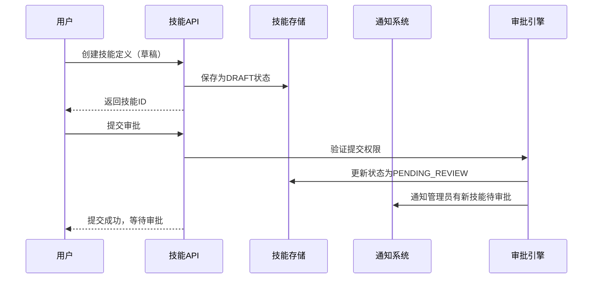
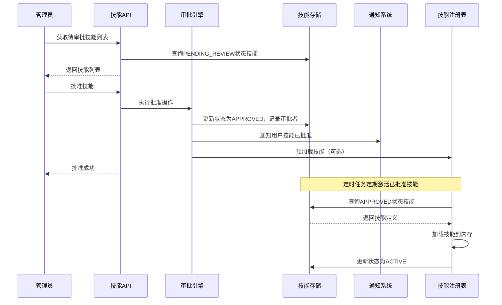
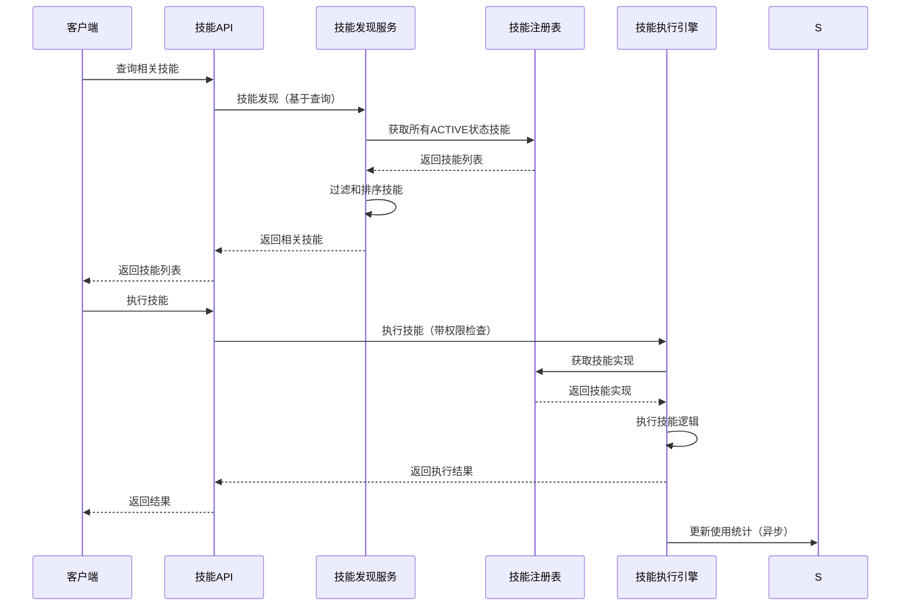

# 动态技能注册与审批系统设计方案

## 1. 概述

### 1.1 背景
当前 AIOps 技能注册机制存在严重的不灵活性：技能定义硬编码在代码中，新增或修改技能需要开发人员修改源代码并重新部署。普通用户无法创建和提交新技能，缺乏管理员审批流程，限制了系统的可扩展性和用户参与度。

### 1.2 目标
设计一个支持用户创建、管理员审批的动态技能注册系统，实现以下目标：
- **动态注册**：用户可通过界面创建和提交新技能
- **审批工作流**：管理员审批通过后技能才可用
- **版本管理**：支持技能版本控制和更新
- **安全控制**：基于风险等级的权限和审批机制
- **易用性**：提供 API 和 CLI 两种管理方式

### 1.3 设计原则
1. **向后兼容**：不影响现有技能定义和使用方式
2. **渐进式实施**：分阶段部署，风险可控
3. **用户体验优先**：简化用户提交和管理员审批流程
4. **安全性**：严格的权限控制和审计追踪

## 2. 现有问题分析

### 2.1 代码硬编码问题
- **静态注册**：技能定义在 `aiops/skills_lib/*_skills.py` 文件中硬编码
- **修改复杂**：新增或修改技能需要开发人员修改代码并重新部署
- **版本控制弱**：缺乏技能版本管理和历史追踪

### 2.2 缺乏用户参与
- **管理员中心化**：只有开发人员可以创建和注册技能
- **无审批流程**：技能直接可用，缺乏安全审查机制
- **用户反馈缺失**：普通用户无法贡献或定制技能

### 2.3 安全风险
- **无权限控制**：所有技能对所有用户同等可用
- **无风险评估**：高风险技能缺乏审批环节
- **无审计追踪**：技能创建和使用缺乏审计日志

## 3. 系统架构

### 3.1 整体架构图

```
┌─────────────────────────────────────────────────────────────┐
│                   动态技能注册系统架构                        │
├─────────────────────────────────────────────────────────────┤
│  ┌─────────────┐    ┌─────────────┐    ┌─────────────┐    │
│  │  用户界面   │    │  管理界面   │    │   API层    │    │
│  │ (CLI/Web)  │◄──►│ (CLI/Web)  │◄──►│ (FastAPI)  │    │
│  └─────────────┘    └─────────────┘    └─────────────┘    │
│                              │                             │
│  ┌─────────────────────────────────────────────────────┐  │
│  │                 业务逻辑层                           │  │
│  │  • 技能提交服务       • 审批工作流服务               │  │
│  │  • 技能验证服务       • 通知服务                     │  │
│  │  • 技能发布服务       • 版本管理服务                 │  │
│  └─────────────────────────────────────────────────────┘  │
│                              │                             │
│  ┌─────────────────────────────────────────────────────┐  │
│  │                 数据访问层                           │  │
│  │  • 技能存储接口       • 审批记录存储                 │  │
│  │  • 用户存储接口       • 审计日志存储                 │  │
│  └─────────────────────────────────────────────────────┘  │
│                              │                             │
│  ┌─────────────────────────────────────────────────────┐  │
│  │                 存储层                               │  │
│  │  ┌─────────┐ ┌─────────┐ ┌─────────┐ ┌─────────┐  │  │
│  │  │SQLite/  │ │  Redis  │ │  JSON   │ │  内存   │  │  │
│  │  │PostgreSQL│ │ (缓存)  │ │ (备份)  │ │ (测试)  │  │  │
│  │  └─────────┘ └─────────┘ └─────────┘ └─────────┘  │  │
│  └─────────────────────────────────────────────────────┘  │
└─────────────────────────────────────────────────────────────┘
```

### 3.2 核心组件

| 组件 | 职责 | 现有支持 |
|------|------|----------|
| **技能存储** | 持久化存储技能定义和审批状态 | ❌ 无 |
| **技能注册表** | 管理已批准技能的加载和缓存 | ✅ 部分支持 |
| **技能发现** | 基于查询发现相关技能 | ✅ 支持 |
| **审批工作流** | 管理技能提交、审批、拒绝流程 | ❌ 无 |
| **审批引擎** | 执行审批逻辑和状态转换 | ❌ 无 |
| **通知系统** | 通知管理员和用户审批状态 | ❌ 无 |
| **审计日志** | 记录所有审批和技能操作 | ✅ 部分支持 |
| **权限控制** | 基于角色控制技能访问 | ✅ 部分支持 |

### 3.3 数据流

1. **用户提交技能**
   ```
   用户 → 提交技能定义 → 技能存储(状态: pending) → 通知管理员
   ```

2. **管理员审批**
   ```
   管理员 → 审查技能 → 审批引擎 → 更新状态(approved/rejected) → 通知用户
   ```

3. **技能激活**
   ```
   技能状态变为approved → 技能注册表加载技能 → 技能发现可用
   ```

## 4. 数据模型设计

### 4.1 扩展技能定义模型

```python
from enum import Enum
from datetime import datetime
from typing import Optional
from pydantic import BaseModel, Field

class SkillStatus(str, Enum):
    """技能状态枚举"""
    DRAFT = "draft"              # 草稿状态
    PENDING_REVIEW = "pending_review"  # 待审批
    APPROVED = "approved"        # 已批准
    REJECTED = "rejected"        # 已拒绝
    ACTIVE = "active"            # 已激活可用
    DEPRECATED = "deprecated"    # 已弃用
    ARCHIVED = "archived"        # 已归档

class SkillApprovalRecord(BaseModel):
    """技能审批记录"""
    approval_id: str
    skill_id: str
    action: str  # "submit", "approve", "reject", "update"
    performed_by: str  # 操作者用户名
    performed_at: datetime = Field(default_factory=datetime.now)
    reason: Optional[str] = None  # 审批意见或拒绝原因
    metadata: dict = Field(default_factory=dict)

class SkillRecord(BaseModel):
    """技能记录（包含审批元数据）"""
    # 基础技能定义
    definition: SkillDefinition

    # 审批相关字段
    status: SkillStatus = SkillStatus.DRAFT
    submitted_by: Optional[str] = None  # 提交者
    submitted_at: Optional[datetime] = None
    approved_by: Optional[str] = None  # 审批者
    approved_at: Optional[datetime] = None
    rejection_reason: Optional[str] = None  # 拒绝原因

    # 版本控制
    version: str = "1.0.0"
    previous_version: Optional[str] = None
    is_latest: bool = True

    # 性能指标
    usage_count: int = 0
    last_used_at: Optional[datetime] = None
    avg_execution_time: Optional[float] = None
    success_rate: Optional[float] = None

    # 审计字段
    created_at: datetime = Field(default_factory=datetime.now)
    updated_at: datetime = Field(default_factory=datetime.now)
    created_by: Optional[str] = None
```

### 4.2 审批工作流状态机

```python
from enum import Enum
from dataclasses import dataclass
from typing import Dict, List, Optional

class ApprovalAction(str, Enum):
    SUBMIT = "submit"      # 用户提交
    APPROVE = "approve"    # 管理员批准
    REJECT = "reject"      # 管理员拒绝
    REQUEST_CHANGES = "request_changes"  # 要求修改
    RESUBMIT = "resubmit"  # 用户重新提交
    ACTIVATE = "activate"  # 系统激活
    DEPRECATE = "deprecate" # 弃用技能

@dataclass
class ApprovalTransition:
    """审批状态转换"""
    from_status: SkillStatus
    to_status: SkillStatus
    action: ApprovalAction
    required_role: Optional[str] = None  # 执行操作所需的角色
    conditions: List[str] = None  # 转换条件

# 审批工作流定义
APPROVAL_WORKFLOW = [
    # 用户提交技能
    ApprovalTransition(
        from_status=SkillStatus.DRAFT,
        to_status=SkillStatus.PENDING_REVIEW,
        action=ApprovalAction.SUBMIT,
        required_role="user"
    ),
    # 管理员批准
    ApprovalTransition(
        from_status=SkillStatus.PENDING_REVIEW,
        to_status=SkillStatus.APPROVED,
        action=ApprovalAction.APPROVE,
        required_role="admin"
    ),
    # 管理员拒绝
    ApprovalTransition(
        from_status=SkillStatus.PENDING_REVIEW,
        to_status=SkillStatus.REJECTED,
        action=ApprovalAction.REJECT,
        required_role="admin"
    ),
    # 系统自动激活（定时任务）
    ApprovalTransition(
        from_status=SkillStatus.APPROVED,
        to_status=SkillStatus.ACTIVE,
        action=ApprovalAction.ACTIVATE,
        required_role="system"
    ),
    # 用户重新提交（被拒绝后）
    ApprovalTransition(
        from_status=SkillStatus.REJECTED,
        to_status=SkillStatus.PENDING_REVIEW,
        action=ApprovalAction.RESUBMIT,
        required_role="user"
    ),
]
```

## 5. 工作流程设计

### 5.1 用户创建和提交技能



### 5.2 管理员审批流程



### 5.3 技能发现和使用流程



## 6. API 设计

### 6.1 技能管理 API

| 端点 | 方法 | 描述 | 权限 |
|------|------|------|------|
| `/api/v1/skills` | GET | 获取技能列表（支持过滤） | 所有用户 |
| `/api/v1/skills` | POST | 创建新技能（草稿） | 所有用户 |
| `/api/v1/skills/{id}` | GET | 获取技能详情 | 所有用户 |
| `/api/v1/skills/{id}` | PUT | 更新技能定义 | 技能所有者或管理员 |
| `/api/v1/skills/{id}/submit` | POST | 提交技能审批 | 技能所有者 |
| `/api/v1/skills/{id}/approve` | POST | 批准技能 | 管理员 |
| `/api/v1/skills/{id}/reject` | POST | 拒绝技能 | 管理员 |
| `/api/v1/skills/{id}/activate` | POST | 激活技能 | 系统 |
| `/api/v1/skills/pending` | GET | 获取待审批技能列表 | 管理员 |
| `/api/v1/skills/search` | GET | 搜索技能 | 所有用户 |

### 6.2 审批工作流 API

| 端点 | 方法 | 描述 | 权限 |
|------|------|------|------|
| `/api/v1/approvals` | GET | 获取审批记录 | 管理员 |
| `/api/v1/approvals/{id}` | GET | 获取审批详情 | 管理员 |
| `/api/v1/approvals/statistics` | GET | 获取审批统计 | 管理员 |
| `/api/v1/workflow/transitions` | GET | 获取可用状态转换 | 根据权限 |

### 6.3 通知 API

| 端点 | 方法 | 描述 | 权限 |
|------|------|------|------|
| `/api/v1/notifications` | GET | 获取用户通知 | 用户本人 |
| `/api/v1/notifications/{id}/read` | POST | 标记通知已读 | 用户本人 |
| `/api/v1/notifications/stats` | GET | 获取通知统计 | 管理员 |

## 7. 存储方案

### 7.1 存储后端选项

| 方案 | 优点 | 缺点 | 适用场景 |
|------|------|------|----------|
| **SQL数据库** | ACID事务，复杂查询，关系模型 | 部署复杂，需要ORM | 生产环境，需要强一致性 |
| **文档数据库** | 灵活Schema，JSON存储，扩展性好 | 事务支持有限 | 快速迭代，灵活需求 |
| **文件存储** | 简单，无需额外服务，易于备份 | 并发控制弱，查询能力有限 | 开发环境，小型部署 |
| **混合存储** | 元数据在DB，实现代码在文件系统 | 复杂度高 | 技能代码频繁更新 |

### 7.2 推荐方案：SQLite + 文件系统（渐进式）

```python
# 存储层抽象
class SkillStorage:
    """技能存储抽象接口"""

    async def save_skill(self, skill_record: SkillRecord) -> str:
        """保存技能记录"""
        pass

    async def get_skill(self, skill_id: str) -> Optional[SkillRecord]:
        """获取技能记录"""
        pass

    async def list_skills(self, status: Optional[SkillStatus] = None,
                         owner: Optional[str] = None) -> List[SkillRecord]:
        """列出技能"""
        pass

    async def update_status(self, skill_id: str, status: SkillStatus,
                          metadata: dict = None) -> bool:
        """更新技能状态"""
        pass

# SQLite 实现
class SQLiteSkillStorage(SkillStorage):
    def __init__(self, db_path: str):
        self.db_path = db_path
        self._init_db()

    def _init_db(self):
        """初始化数据库表"""
        # 创建 skills 表
        # 创建 approvals 表
        # 创建 notifications 表
        pass
```

### 7.3 数据库表设计

```sql
-- 技能表
CREATE TABLE skills (
    id TEXT PRIMARY KEY,
    definition_json TEXT NOT NULL,  -- SkillDefinition 的JSON序列化
    status TEXT NOT NULL,
    submitted_by TEXT,
    submitted_at TIMESTAMP,
    approved_by TEXT,
    approved_at TIMESTAMP,
    version TEXT NOT NULL,
    previous_version TEXT,
    is_latest BOOLEAN DEFAULT TRUE,
    usage_count INTEGER DEFAULT 0,
    last_used_at TIMESTAMP,
    created_at TIMESTAMP DEFAULT CURRENT_TIMESTAMP,
    updated_at TIMESTAMP DEFAULT CURRENT_TIMESTAMP,
    created_by TEXT
);

-- 审批记录表
CREATE TABLE approval_records (
    id TEXT PRIMARY KEY,
    skill_id TEXT NOT NULL,
    action TEXT NOT NULL,
    performed_by TEXT NOT NULL,
    performed_at TIMESTAMP DEFAULT CURRENT_TIMESTAMP,
    reason TEXT,
    metadata_json TEXT,
    FOREIGN KEY (skill_id) REFERENCES skills(id) ON DELETE CASCADE
);

-- 技能索引（加速搜索）
CREATE INDEX idx_skills_status ON skills(status);
CREATE INDEX idx_skills_submitted_by ON skills(submitted_by);
CREATE INDEX idx_skills_created_at ON skills(created_at);
```

## 8. 安全与权限设计

### 8.1 权限模型

| 角色 | 权限 | 描述 |
|------|------|------|
| **普通用户** | 创建技能（草稿）<br>提交技能审批<br>查看公开技能<br>执行低风险技能 | 技能创建者和使用者 |
| **技能管理员** | 审批技能<br>管理技能分类<br>查看所有技能<br>执行中高风险技能 | 技能质量审核者 |
| **系统管理员** | 所有权限<br>管理用户角色<br>系统配置 | 系统维护者 |
| **系统账户** | 自动激活技能<br>清理过期技能<br>发送系统通知 | 自动化任务执行者 |

### 8.2 风险评估矩阵

| 风险等级 | 审批要求 | 执行限制 | 监控级别 |
|----------|----------|----------|----------|
| **LOW** | 无需审批 | 所有用户可执行 | 基础日志 |
| **MEDIUM** | 单管理员审批 | 需要用户确认 | 详细日志 |
| **HIGH** | 双管理员审批 | 需要额外授权 | 实时监控 |
| **CRITICAL** | 管理员+安全团队审批 | 需要手动确认和审计 | 全流程审计 |

### 8.3 安全措施

1. **输入验证**：严格验证技能定义的输入模式
2. **代码沙箱**：高风险技能在隔离环境中执行
3. **执行限流**：限制单个用户的技能执行频率
4. **审计日志**：记录所有技能操作和审批决策
5. **定期审查**：定期审查已批准技能的安全性

## 9. 实施计划

### 9.1 第一阶段：基础框架（1-2周）

**目标**：实现核心数据模型和存储层

1. **扩展数据模型**
   - 创建 `SkillRecord`、`SkillApprovalRecord` 模型
   - 定义 `SkillStatus` 枚举和审批工作流

2. **实现存储层**
   - SQLite 存储实现
   - 文件系统存储技能实现代码

3. **基础 API**
   - 技能 CRUD 接口
   - 状态转换接口

### 9.2 第二阶段：审批工作流（1-2周）

**目标**：完整的审批流程

1. **审批引擎**
   - 状态机实现
   - 权限验证

2. **通知系统**
   - 简单邮件/站内信通知
   - 通知模板

3. **管理界面**
   - 待审批技能列表
   - 审批操作界面

### 9.3 第三阶段：系统集成（1周）

**目标**：与现有 AIOps 系统集成

1. **技能注册表扩展**
   - 从存储加载已批准技能
   - 技能缓存机制

2. **技能发现集成**
   - 扩展 `SkillDiscoveryService` 支持动态技能
   - 性能优化

3. **安全集成**
   - 与现有 `SecurityController` 集成
   - 权限检查集成

### 9.4 第四阶段：高级功能（1-2周）

**目标**：增强用户体验和系统能力

1. **版本控制**
   - 技能版本管理
   - 回滚机制

2. **搜索和发现**
   - 全文搜索
   - 智能推荐

3. **监控和告警**
   - 技能执行监控
   - 审批延迟告警

## 10. 影响评估

### 10.1 对现有系统的影响

| 组件 | 影响程度 | 修改内容 |
|------|----------|----------|
| **SkillDefinition** | 低 | 扩展字段，保持向后兼容 |
| **SkillRegistry** | 中 | 改为从存储加载，添加缓存 |
| **SkillDiscoveryService** | 低 | 支持过滤非ACTIVE状态技能 |
| **SkillExecutionRuntime** | 低 | 添加权限检查 |
| **现有技能库** | 无 | 保持不变，可迁移为预批准技能 |

### 10.2 迁移策略

1. **并行运行**：新系统与现有系统并行，逐步迁移
2. **数据迁移**：将现有技能标记为预批准状态
3. **渐进切换**：按技能类别逐步切换到新系统
4. **回滚预案**：保留快速回滚到硬编码方案的能力

### 10.3 性能影响

| 场景 | 现有方案 | 新方案 | 优化措施 |
|------|----------|--------|----------|
| **技能加载** | O(1) 内存加载 | O(n) 数据库查询 | 缓存机制，延迟加载 |
| **技能发现** | O(n) 内存搜索 | O(n) 数据库搜索 | 建立索引，预加载常用技能 |
| **技能执行** | O(1) 函数调用 | O(1) 函数调用 | 执行路径不变 |

## 11. 风险与缓解

### 11.1 技术风险

| 风险 | 概率 | 影响 | 缓解措施 |
|------|------|------|----------|
| **存储性能瓶颈** | 中 | 高 | 实现缓存层，分页查询，定期归档 |
| **审批流程阻塞** | 低 | 中 | 设置审批超时，自动提醒，备审人员 |
| **技能实现安全** | 中 | 高 | 代码审查，沙箱执行，输入验证 |
| **系统兼容性问题** | 低 | 中 | 充分测试，版本兼容性检查 |

### 11.2 组织风险

| 风险 | 缓解措施 |
|------|----------|
| **用户接受度低** | 提供简洁的用户界面，详细的使用文档，培训材料 |
| **管理员工作负担** | 自动化初步审查，智能分类，批量操作支持 |
| **技能质量不一** | 制定技能开发规范，提供模板，代码审查工具 |

## 12. 成功指标

### 12.1 技术指标

| 指标 | 目标 | 测量方式 |
|------|------|----------|
| **技能提交到激活时间** | < 24小时 | 审批流程时间统计 |
| **系统可用性** | > 99.5% | 监控系统正常运行时间 |
| **技能发现延迟** | < 100ms | API 响应时间监控 |
| **存储性能** | 支持1000+技能 | 压力测试 |

### 12.2 业务指标

| 指标 | 目标 | 测量方式 |
|------|------|----------|
| **用户参与度** | 每月10+新技能提交 | 技能提交统计 |
| **技能使用率** | 80%技能每月至少使用一次 | 技能执行日志 |
| **审批通过率** | > 70% | 审批记录分析 |
| **用户满意度** | > 4/5分 | 用户反馈收集 |

## 13. 后续演进

### 13.1 短期改进（3-6个月）

1. **技能市场**：允许用户分享和复用技能
2. **协作开发**：多人协作开发复杂技能
3. **自动化测试**：技能实现的自动化测试框架
4. **智能推荐**：基于使用历史的技能推荐

### 13.2 长期愿景（6-12个月）

1. **技能组合市场**：预构建的技能组合和工作流
2. **技能质量评分**：基于使用效果的质量评估体系
3. **跨组织共享**：安全的技能共享和协作
4. **AI辅助开发**：AI生成技能实现和测试用例

---

## 附录

### A. 依赖变更

```toml
# pyproject.toml 新增依赖
dependencies = [
    # 现有依赖...

    # 数据库支持
    "sqlmodel>=0.0.16",
    "alembic>=1.13.0",

    # API增强
    "fastapi>=0.104.0",
    "python-multipart>=0.0.6",  # 文件上传支持

    # 通知支持（可选）
    # "pydantic-settings>=2.0.0",
    # "redis>=5.0.0",  # 缓存和消息队列
]
```

### B. 文件结构扩展

```
aiops/
├── skills/                       # 技能系统（扩展）
│   ├── __init__.py
│   ├── models.py                # 扩展数据模型
│   ├── storage.py               # 技能存储接口和实现
│   ├── approval_workflow.py     # 审批工作流
│   ├── notification.py          # 通知服务
│   └── dynamic_registry.py      # 动态技能注册表
├── api/                         # API扩展
│   ├── skill_management.py      # 技能管理API
│   ├── approval_api.py          # 审批API
│   └── notification_api.py      # 通知API
└── cli/                         # CLI扩展
    ├── skill_commands.py        # 技能管理命令
    └── approval_commands.py     # 审批管理命令
```

### C. 现有技能迁移脚本

```python
def migrate_existing_skills():
    """将现有硬编码技能迁移到动态注册系统"""
    from aiops.skills_lib import (
        PROMETHEUS_SKILLS,
        VICTORIALOGS_SKILLS,
        FAULT_DIAGNOSIS_SKILLS,
        SECURITY_SKILLS
    )

    all_existing_skills = (
        PROMETHEUS_SKILLS +
        VICTORIALOGS_SKILLS +
        FAULT_DIAGNOSIS_SKILLS +
        SECURITY_SKILLS
    )

    for skill_def in all_existing_skills:
        # 创建预批准记录
        skill_record = SkillRecord(
            definition=skill_def,
            status=SkillStatus.ACTIVE,  # 直接激活
            submitted_by="system",      # 系统迁移
            submitted_at=datetime.now(tz=timezone.utc).isoformat(),
            approved_by="system",
            approved_at=datetime.now(tz=timezone.utc).isoformat(),
            version="1.0.0",
            is_latest=True
        )

        # 保存到存储
        storage.save_skill(skill_record)

    print(f"Migrated {len(all_existing_skills)} existing skills")
```

---

*设计方案版本：1.0*
*创建日期：2026-03-10*
*更新记录：2026-03-10 - 初始版本*