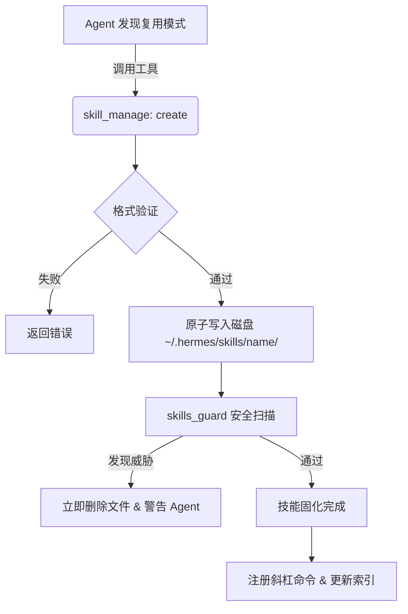

# Skills 自学习系统深度解析：Agent 如何固化 Skills

本文档深入解析了 Hermes Agent 的 Skills 自学习系统，特别是 Agent 如何将临时的上下文经验转化为持久化、可复用的 `SKILL.md` 文件（即“固化”过程）。

## 1. 概述

在 Hermes Agent 中，**“固化”（Solidification）** 是指将 Agent 在任务执行过程中发现的成功模式、复杂工作流或错误修复方案，通过 `tools/skill_manager_tool.py` 转化为持久化存储的技能文件的过程。

这一过程不仅是简单的文件写入，而是一个包含**触发、验证、原子写入、安全扫描**和**动态加载**的完整闭环。

## 2. 触发机制：从经验到意图

Agent 决定固化技能通常源于两种场景：

### 2.1 系统诱导 (System Nudging)
在 `run_agent.py` 中，系统会监控当前任务的迭代次数。如果一个任务涉及复杂的长流程（通常 >5 次工具调用），系统会在下一轮对话中自动插入一条提示：
> *"[System: 上一个任务涉及多个步骤。如果你发现了可复用的工作流，请考虑将其保存为技能。]"*

### 2.2 自主决策
Agent 基于 System Prompt 中的指令，在以下情况主动决定调用 `skill_manage`：
- 成功解决了棘手的错误（Error Recovery）。
- 发现了非平凡（Non-trivial）的通用工作流。
- 用户显式要求记住某个操作流程。

## 3. 固化核心流程

当 Agent 决定固化时，它会调用 `skill_manage(action='create', ...)`。该函数的内部执行流程如下：

### 3.1 结构验证
Agent 生成的 Markdown 内容必须包含合法的 YAML Frontmatter：

```yaml
---
name: git-bisect-debug    # 必须匹配正则 ^[a-z0-9][a-z0-9._-]*$
description: "使用 git bisect 自动定位引入 bug 的 commit"
platforms: [macos, linux] # 可选：平台限制
---
```

代码引用：[skill_manager_tool.py:109-145](file:///Users/zengshenglong/Code/PyWorkSpace/hermes-agent/tools/skill_manager_tool.py#L109-145)

### 3.2 原子写入 (Atomic Write)
为了防止在写入过程中程序崩溃导致文件损坏，系统采用“写临时文件 -> 重命名”的策略：
1.  在目标目录创建 `.SKILL.md.tmp.xxxx`。
2.  写入内容并 flush。
3.  使用 `os.replace()` 替换目标文件。

代码引用：[skill_manager_tool.py:194-224](file:///Users/zengshenglong/Code/PyWorkSpace/hermes-agent/tools/skill_manager_tool.py#L194-224)

### 3.3 辅助文件支持
Agent 不仅可以创建主文件，还可以通过 `action='write_file'` 固化配套资源。系统严格限制只能写入以下子目录：
- `references/`: API 文档、参考手册。
- `templates/`: 代码脚手架、配置模板。
- `scripts/`: 自动化脚本（Python/Bash）。
- `assets/`: 其他静态资源。

## 4. 安全防线：Skills Guard

在文件写入磁盘后，**但在返回成功结果给 Agent 之前**，系统会立即触发安全扫描。

### 4.1 扫描机制
`tools/skills_guard.py` 会对目录下的所有文件进行正则扫描。如果扫描结果为 `caution` 或 `dangerous`，`skill_manager_tool` 会立即执行 `shutil.rmtree()` 删除刚刚创建的技能目录，并向 Agent 返回错误信息。

### 4.2 威胁检测
系统维护了 100+ 种威胁模式的黑名单，包括：
- **数据外泄**: `curl ... $ENV_VAR`
- **Prompt 注入**: 使用零宽字符隐藏指令、`ignore previous instructions`
- **破坏性命令**: `rm -rf /`, `mkfs`
- **持久化后门**: 修改 `.bashrc`, `crontab`

代码引用：[skill_manager_tool.py:259-262](file:///Users/zengshenglong/Code/PyWorkSpace/hermes-agent/tools/skill_manager_tool.py#L259-262)

## 5. 动态生效与加载

一旦技能成功固化（写入 `~/.hermes/skills/`），它会立即生效，无需重启：

1.  **索引更新**: 下一次调用 `skills_list` 时，新技能会出现在列表中。
2.  **命令映射**: `agent/skill_commands.py` 会在后台扫描该目录，自动注册对应的斜杠命令（如 `/git-bisect-debug`）。
3.  **渐进式披露**: Agent 不会一次性读取所有技能内容，而是通过 `skills_list` 获取元数据，仅在需要时通过 `skill_view` 加载具体内容。

## 6. 流程总结


