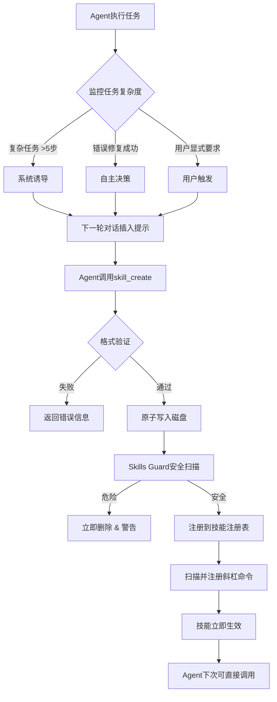

# AIOps Skills 自学习系统设计

## 概述

本文档基于 Hermes Agent 的 Skills 自学习系统架构，结合 AIOps 项目的现有 skills 管理功能，设计一套完整的 Skills 自学习、固化、安全管理体系。

## 1. 现状分析

### 1.1 AIOps 项目现有 skills 系统
- **技能模型**：`SkillDefinition`、`SkillCategory`、`SkillRiskLevel` 等数据模型已完备
- **技能注册表**：`SkillRegistry` 提供基本的注册和查询功能
- **技能发现服务**：`SkillDiscoveryService` 支持按查询和标签发现技能
- **技能库**：`skills_lib/` 目录包含四大类技能（监控、日志、故障、安全）
- **API/CLI**：提供 `skill_api.py` 和 `skill_cli.py` 管理接口

### 1.2 现有系统局限性
1. **静态技能库**：技能需硬编码定义，无法动态生成
2. **无自学习能力**：Agent 无法从成功经验中固化新技能
3. **无安全管理**：缺乏技能执行安全扫描和权限控制
4. **无渐进式披露**：所有技能一次性加载，无上下文感知
5. **无技能版本管理**：不支持技能更新和回滚

## 2. Hermes Agent Skills 系统分析

### 2.1 核心优势
1. **技能固化（Solidification）**：Agent 可将成功经验转化为持久化技能
2. **安全扫描（Skills Guard）**：写入后立即扫描，拦截危险代码
3. **渐进式披露**：仅加载相关技能内容，优化上下文使用
4. **动态命令注册**：自动扫描技能目录注册为斜杠命令
5. **闭环学习**：系统诱导 + Agent 自主决策的技能生成

### 2.2 关键组件
1. **skill_manager_tool.py**：技能 CRUD 操作，支持原子写入
2. **skill_commands.py**：技能命令扫描和构建
3. **skills_guard.py**：100+ 威胁模式安全扫描
4. **AGENTS.md**：系统提示词，包含技能索引和固化指令

## 3. 融合架构设计

### 3.1 整体架构

```
┌─────────────────────────────────────────────────────────────┐
│                   AIOps Skills 自学习系统                   │
├─────────────────────────────────────────────────────────────┤
│  ┌─────────────────┐  ┌─────────────────┐  ┌─────────────┐  │
│  │   现有技能系统  │  │   Skills自学习  │  │ 安全与审计  │  │
│  │  ┌──────────┐   │  │  ┌──────────┐   │  │  ┌───────┐  │  │
│  │  │ Registry │   │  │  │ Manager  │   │  │  │ Guard │  │  │
│  │  └──────────┘   │  │  └──────────┘   │  │  └───────┘  │  │
│  │  ┌──────────┐   │  │  ┌──────────┐   │  │  ┌───────┐  │  │
│  │  │Discovery │   │  │  │ Commands │   │  │  │ Audit │  │  │
│  │  └──────────┘   │  │  └──────────┘   │  │  └───────┘  │  │
│  │  ┌──────────┐   │  │                 │  │             │  │
│  │  │Library   │   │  │                 │  │             │  │
│  │  └──────────┘   │  │                 │  │             │  │
│  └─────────────────┘  └─────────────────┘  └─────────────┘  │
│                                                              │
│  ┌──────────────────────────────────────────────────────┐   │
│  │                 LangGraph Agent 集成                 │   │
│  │  ┌─────────────────┐  ┌──────────────────────────┐  │   │
│  │  │   固化诱导器    │  │     技能调用节点         │  │   │
│  │  │  (Nudging)      │  │  (Skill Invocation)      │  │   │
│  │  └─────────────────┘  └──────────────────────────┘  │   │
│  └──────────────────────────────────────────────────────┘   │
└─────────────────────────────────────────────────────────────┘
```

### 3.2 核心模块设计

#### 3.2.1 Skill Manager Tool（扩展现有 Registry）

```python
class SkillManager:
    """技能管理工具，支持动态技能创建和更新"""

    def __init__(self, base_dir: Path = SKILLS_HOME):
        self.base_dir = base_dir
        self.skills_dir = base_dir / "skills"
        self.skills_dir.mkdir(parents=True, exist_ok=True)

    def create_skill(self, name: str, content: str, metadata: Dict[str, Any]) -> SkillDefinition:
        """创建新技能（固化）"""
        # 1. 验证技能名称格式
        self._validate_skill_name(name)

        # 2. 构建技能目录结构
        skill_dir = self.skills_dir / name
        skill_dir.mkdir(exist_ok=True)

        # 3. 原子写入 SKILL.md（含 YAML frontmatter）
        self._atomic_write(skill_dir / "SKILL.md", content)

        # 4. 安全扫描
        scan_result = self._security_scan(skill_dir)
        if scan_result.risk_level == "dangerous":
            shutil.rmtree(skill_dir)
            raise SecurityError(f"技能包含危险内容: {scan_result.details}")

        # 5. 构建 SkillDefinition 并注册到全局 Registry
        skill_def = self._build_skill_definition(name, metadata, skill_dir)
        return skill_def

    def patch_skill(self, skill_id: str, old_str: str, new_str: str) -> bool:
        """局部更新技能（推荐方式）"""
        # 查找技能文件
        skill_file = self._find_skill_file(skill_id)

        # 执行字符串替换
        content = skill_file.read_text()
        if old_str not in content:
            return False

        new_content = content.replace(old_str, new_str)

        # 原子写入并重新扫描
        self._atomic_write(skill_file, new_content)

        # 重新扫描安全
        return self._security_scan(skill_file.parent).risk_level == "safe"

    def list_user_skills(self) -> List[Dict[str, Any]]:
        """列出用户创建的技能"""
        return [self._parse_skill_info(d) for d in self.skills_dir.iterdir()
                if d.is_dir() and (d / "SKILL.md").exists()]
```

#### 3.2.2 Skills Guard（安全扫描）

```python
class SkillsGuard:
    """技能安全扫描器"""

    DANGEROUS_PATTERNS = [
        # 数据外泄
        (r'curl.*\$ENV', 'dangerous', "可能泄露环境变量"),
        (r'wget.*\$ENV', 'dangerous', "可能泄露环境变量"),

        # 破坏性命令
        (r'rm\s+-rf\s+/', 'dangerous', "删除根目录"),
        (r'mkfs\.', 'dangerous', "格式化文件系统"),

        # 持久化后门
        (r'echo.*>>\s*~/(\.bashrc|\.zshrc)', 'dangerous', "修改Shell配置文件"),
        (r'crontab.*-e', 'dangerous', "修改定时任务"),

        # AIOps 特定风险
        (r'service\s+stop', 'caution', "停止服务"),
        (r'kill\s+-9', 'caution', "强制杀死进程"),
        (r'iptables.*DROP', 'caution', "防火墙规则修改"),
    ]

    def scan_skill(self, skill_dir: Path) -> ScanResult:
        """扫描技能目录"""
        results = []

        for file_path in skill_dir.rglob("*"):
            if file_path.is_file():
                try:
                    content = file_path.read_text()
                    for pattern, level, desc in self.DANGEROUS_PATTERNS:
                        if re.search(pattern, content, re.IGNORECASE):
                            results.append({
                                'file': str(file_path.relative_to(skill_dir)),
                                'level': level,
                                'description': desc,
                                'pattern': pattern
                            })
                except UnicodeDecodeError:
                    # 跳过二进制文件
                    continue

        # 计算总体风险等级
        if any(r['level'] == 'dangerous' for r in results):
            overall_risk = 'dangerous'
        elif any(r['level'] == 'caution' for r in results):
            overall_risk = 'caution'
        else:
            overall_risk = 'safe'

        return ScanResult(risk_level=overall_risk, details=results)
```

#### 3.2.3 Skill Commands（动态命令注册）

```python
class SkillCommandsManager:
    """技能命令管理器"""

    def scan_and_register_commands(self) -> Dict[str, SkillCommandInfo]:
        """扫描技能目录并注册斜杠命令"""
        commands = {}

        for skill_dir in self.skills_dir.iterdir():
            skill_md = skill_dir / "SKILL.md"
            if skill_md.exists():
                try:
                    # 解析 YAML frontmatter
                    content = skill_md.read_text()
                    metadata = self._parse_frontmatter(content)

                    # 构建命令名称
                    cmd_name = metadata.get('name', skill_dir.name)
                    cmd_slug = self._slugify(cmd_name)

                    # 注册命令
                    commands[f"/{cmd_slug}"] = SkillCommandInfo(
                        name=cmd_name,
                        description=metadata.get('description', ''),
                        category=metadata.get('category', 'custom'),
                        skill_dir=skill_dir,
                        skill_file=skill_md
                    )
                except Exception as e:
                    logger.warning(f"Failed to parse skill {skill_dir}: {e}")

        return commands

    def get_skill_content(self, cmd_slug: str) -> Optional[str]:
        """获取技能完整内容（渐进式披露）"""
        cmd_info = self.commands.get(f"/{cmd_slug}")
        if not cmd_info:
            return None

        try:
            content = cmd_info.skill_file.read_text()

            # 构建完整的技能调用消息
            parts = [
                f'[SYSTEM: 用户调用了 "{cmd_info.name}" 技能。技能内容如下：]',
                "",
                content.strip(),
                "",
                f'[SYSTEM: 请根据以上技能说明执行相关操作。]'
            ]

            # 添加支持文件
            for subdir in ["references", "templates", "scripts", "assets"]:
                subdir_path = cmd_info.skill_dir / subdir
                if subdir_path.exists():
                    for file_path in sorted(subdir_path.rglob("*")):
                        if file_path.is_file():
                            try:
                                file_content = file_path.read_text()
                                parts.append(f"### {file_path.relative_to(cmd_info.skill_dir)}")
                                parts.append("```")
                                parts.append(file_content[:500])  # 限制长度
                                if len(file_content) > 500:
                                    parts.append("...")
                                parts.append("```")
                            except UnicodeDecodeError:
                                continue

            return "\n".join(parts)
        except Exception as e:
            logger.error(f"Failed to load skill {cmd_slug}: {e}")
            return None
```

### 3.3 LangGraph Agent 集成

#### 3.3.1 扩展 RouterState

```python
from typing import TypedDict, List, Optional, Dict, Any
from typing_extensions import Annotated

class EnhancedRouterState(TypedDict):
    """扩展的 Router 状态，包含技能相关信息"""
    query: str
    classifications: List[Classification]
    results: Annotated[List[AgentOutput], operator.add]
    final_answer: str

    # 技能系统相关字段
    detected_skills: List[SkillDefinition]  # 检测到的相关技能
    skill_execution_count: int  # 当前任务技能调用次数
    should_solidify: bool  # 是否应该固化当前工作流
    solidification_candidate: Optional[Dict[str, Any]]  # 待固化的技能信息
    user_skills_used: List[str]  # 使用的用户技能列表
```

#### 3.3.2 技能固化诱导节点

```python
def skill_solidification_nudging_node(state: EnhancedRouterState) -> Dict[str, Any]:
    """技能固化诱导节点"""

    # 触发条件：
    # 1. 技能调用次数 > 5 次的复杂任务
    # 2. 成功解决错误（从失败到成功）
    # 3. 发现非平凡工作流

    should_nudge = False
    nudge_message = ""

    if state["skill_execution_count"] >= 5:
        should_nudge = True
        nudge_message = (
            "[System: 上一个任务涉及多个步骤。如果这是一个可复用的工作流，"
            "请考虑使用 `skill_create` 将其保存为技能。]"
        )
    elif "error" in state["query"].lower() and "success" in state["final_answer"].lower():
        should_nudge = True
        nudge_message = (
            "[System: 你成功解决了一个错误。这个错误修复过程可能对将来有用。"
            "考虑将其固化为技能。]"
        )

    return {
        "should_solidify": should_nudge,
        "nudge_message": nudge_message if should_nudge else "",
        "solidification_candidate": {
            "workflow_steps": state.get("workflow_steps", []),
            "success_pattern": state.get("success_pattern", ""),
            "complexity_score": state["skill_execution_count"]
        } if should_nudge else None
    }
```

#### 3.3.3 技能调用节点

```python
def skill_invocation_node(state: EnhancedRouterState) -> Dict[str, Any]:
    """技能调用节点"""

    # 1. 从查询中检测技能命令
    skill_commands = skill_manager.get_commands()
    invoked_skill = None

    for cmd, info in skill_commands.items():
        if state["query"].startswith(cmd):
            invoked_skill = info
            break

    if not invoked_skill:
        return {"skill_invoked": False}

    # 2. 获取技能内容（渐进式披露）
    skill_content = skill_manager.get_skill_content(invoked_skill["slug"])

    if not skill_content:
        return {
            "skill_invoked": True,
            "skill_success": False,
            "skill_error": "技能加载失败"
        }

    # 3. 构建技能执行上下文
    skill_context = {
        "original_query": state["query"],
        "skill_name": invoked_skill["name"],
        "skill_content": skill_content,
        "user_instruction": state["query"].replace(cmd, "").strip()
    }

    return {
        "skill_invoked": True,
        "skill_name": invoked_skill["name"],
        "skill_context": skill_context,
        "user_skills_used": state.get("user_skills_used", []) + [invoked_skill["name"]]
    }
```

### 3.4 技能固化流程

#### 3.4.1 固化触发机制



#### 3.4.2 技能文件格式

```yaml
---
# YAML frontmatter（必需）
name: "diagnose-high-cpu"
description: "诊断CPU使用率过高的根本原因"
category: "diagnosis"
version: "1.0.0"
author: "AIOps Agent"
created_at: "2026-03-11T10:30:00Z"
risk_level: "medium"
platforms: ["linux", "macos"]
dependencies: ["psutil", "prometheus-client"]
tags: ["cpu", "diagnosis", "performance"]
---

# 技能说明

## 概述
诊断CPU使用率过高的根本原因。适用于Linux和macOS系统。

## 输入参数
- `threshold` (float): CPU使用率阈值，默认80.0
- `duration` (string): 监控时长，如"5m", "1h"
- `process_details` (bool): 是否显示进程详情，默认true

## 执行步骤

### 1. 检查系统整体CPU使用率
```bash
# 使用top命令获取CPU使用率
top -bn1 | grep "Cpu(s)" | awk '{print $2}' | cut -d'%' -f1
```

### 2. 检查占用CPU最高的进程
```bash
# 使用ps命令按CPU排序
ps aux --sort=-%cpu | head -10
```

### 3. 分析进程类型
- 如果是Java进程：检查GC日志和堆内存
- 如果是数据库进程：检查慢查询和锁
- 如果是应用进程：检查线程堆栈

### 4. Prometheus指标检查（如果可用）
查询Prometheus中的CPU相关指标：
- `process_cpu_seconds_total`
- `node_cpu_seconds_total`

## 输出格式
```json
{
  "overall_cpu_percent": 85.5,
  "top_processes": [
    {"pid": 1234, "name": "java", "cpu_percent": 45.2},
    {"pid": 5678, "name": "postgres", "cpu_percent": 25.1}
  ],
  "root_cause": "Java进程GC频繁导致CPU飙升",
  "recommendations": [
    "增加JVM堆内存",
    "优化GC参数",
    "检查内存泄漏"
  ]
}
```

## 注意事项
1. 需要root权限获取完整进程信息
2. Prometheus查询需要配置正确的数据源
3. 某些容器环境可能需要特殊处理
```

## 4. 实施计划

### 4.1 第一阶段：基础框架（3-4天）

#### 任务1：扩展技能模型（1天）
- 添加 `UserSkillDefinition` 继承自 `SkillDefinition`
- 添加技能文件路径、创建时间、作者等字段
- 添加技能版本管理和更新历史

#### 任务2：实现 SkillManager（1天）
- 移植 Hermes Agent 的 `skill_manager_tool.py` 核心逻辑
- 适配 AIOps 项目的数据模型
- 实现原子写入和安全扫描接口

#### 任务3：实现 SkillsGuard（1天）
- 移植威胁模式检测规则
- 添加 AIOps 特定风险规则
- 实现扫描结果报告格式

#### 任务4：实现 SkillCommands（1天）
- 移植动态命令扫描和注册逻辑
- 实现渐进式披露内容加载
- 集成到现有 CLI/API 系统

### 4.2 第二阶段：Agent 集成（2-3天）

#### 任务5：扩展 RouterState 和节点（1天）
- 添加技能相关状态字段
- 实现技能固化诱导节点
- 实现技能调用节点

#### 任务6：系统提示词更新（1天）
- 更新 AGENT.md 包含技能固化指令
- 添加技能调用和创建的系统指令
- 配置触发条件和最佳实践

#### 任务7：测试与调试（1天）
- 测试技能创建完整流程
- 测试安全扫描拦截机制
- 测试命令注册和调用

### 4.3 第三阶段：高级功能（2-3天）

#### 任务8：技能版本管理（1天）
- 实现技能版本控制和回滚
- 添加强制更新和冲突解决
- 添加技能依赖关系管理

#### 任务9：技能性能监控（1天）
- 记录技能执行次数和成功率
- 实现技能热度和质量评分
- 添加技能废弃和归档机制

#### 任务10：文档和部署（1天）
- 编写用户指南和开发文档
- 创建技能模板和示例
- 部署到测试环境验证

## 5. 安全考虑

### 5.1 风险类别
1. **代码注入**：技能内容可能包含恶意代码
2. **数据泄露**：技能可能泄露敏感信息
3. **系统破坏**：技能可能执行破坏性操作
4. **权限提升**：技能可能绕过权限控制

### 5.2 防护措施
1. **静态扫描**：写入前进行正则模式匹配
2. **动态沙箱**：高风险技能在受限环境执行
3. **权限分级**：根据风险等级分配不同权限
4. **审计日志**：记录所有技能创建和执行操作

### 5.3 AIOps 特定风险
1. **服务中断**：技能可能误停止关键服务
2. **配置篡改**：技能可能修改生产配置
3. **数据污染**：技能可能污染监控数据
4. **资源耗尽**：技能可能耗尽系统资源

## 6. 与现有系统集成

### 6.1 数据模型兼容
```python
# 现有 SkillDefinition 扩展
class EnhancedSkillDefinition(SkillDefinition):
    """增强的技能定义，支持自学习特性"""

    # 新增字段
    skill_type: Literal["builtin", "user_created"] = "builtin"
    skill_file_path: Optional[Path] = None
    skill_dir: Optional[Path] = None
    created_by: Optional[str] = None  # "system" 或 "user:username"
    created_at: datetime = Field(default_factory=datetime.now)
    updated_at: datetime = Field(default_factory=datetime.now)
    version_history: List[Dict[str, Any]] = Field(default_factory=list)

    # 性能指标
    execution_count: int = 0
    success_rate: float = 1.0
    avg_execution_time: Optional[float] = None

    # 安全信息
    last_scan_result: Optional[ScanResult] = None
    risk_level: SkillRiskLevel = SkillRiskLevel.LOW
```

### 6.2 Registry 扩展
```python
class EnhancedSkillRegistry(SkillRegistry):
    """增强的技能注册表，支持动态技能管理"""

    def __init__(self):
        super().__init__()
        self.user_skills: Dict[str, EnhancedSkillDefinition] = {}
        self.skill_manager = SkillManager()
        self.commands_manager = SkillCommandsManager()

    def register_user_skill(self, skill_def: EnhancedSkillDefinition) -> None:
        """注册用户创建的技能"""
        self.user_skills[skill_def.id] = skill_def
        # 同时注册到全局技能表
        self.register(skill_def)

        # 触发命令重新扫描
        self.commands_manager.scan_and_register_commands()

    def scan_and_load_user_skills(self) -> None:
        """扫描磁盘上的用户技能并加载"""
        user_skills = self.skill_manager.list_user_skills()
        for skill_info in user_skills:
            skill_def = self._load_skill_from_disk(skill_info)
            self.register_user_skill(skill_def)
```

### 6.3 API 扩展
```python
# 扩展 skill_api.py
@app.post("/skills/create")
async def create_skill(
    request: SkillCreateRequest,
    authorization: str = Header(...)
):
    """创建新技能"""
    # 验证权限
    if not await auth_service.can_create_skills(authorization):
        raise HTTPException(status_code=403, detail="无权创建技能")

    # 调用技能管理器
    try:
        skill_def = skill_manager.create_skill(
            name=request.name,
            content=request.content,
            metadata=request.metadata
        )

        # 注册到全局注册表
        enhanced_registry.register_user_skill(skill_def)

        return {
            "success": True,
            "skill_id": skill_def.id,
            "command": f"/{skill_def.name.replace(' ', '-').lower()}",
            "message": "技能创建成功，已注册为斜杠命令"
        }
    except SecurityError as e:
        raise HTTPException(status_code=400, detail=str(e))
    except Exception as e:
        raise HTTPException(status_code=500, detail=f"技能创建失败: {str(e)}")

@app.get("/skills/user")
async def list_user_skills():
    """列出用户创建的技能"""
    return [skill.model_dump() for skill in enhanced_registry.user_skills.values()]

@app.post("/skills/{skill_id}/scan")
async def scan_skill(skill_id: str):
    """重新扫描技能安全性"""
    skill_def = enhanced_registry.get(skill_id)
    if not skill_def or not skill_def.skill_dir:
        raise HTTPException(status_code=404, detail="技能不存在或非用户技能")

    scan_result = skills_guard.scan_skill(skill_def.skill_dir)

    # 更新技能安全状态
    skill_def.last_scan_result = scan_result
    skill_def.risk_level = SkillRiskLevel.HIGH if scan_result.risk_level == "dangerous" else SkillRiskLevel.LOW

    return {
        "skill_id": skill_id,
        "scan_result": scan_result.dict(),
        "risk_level": skill_def.risk_level.value
    }
```

## 7. 配置与部署

### 7.1 环境变量
```bash
# 技能系统配置
AIOPS_SKILLS_HOME="${HOME}/.aiops/skills"  # 技能存储目录
AIOPS_SKILLS_SCAN_ENABLED="true"           # 是否启用安全扫描
AIOPS_SKILLS_AUTO_REGISTER="true"          # 是否自动注册斜杠命令
AIOPS_SKILLS_MAX_SIZE_MB="10"              # 单个技能最大大小（MB）
AIOPS_SKILLS_ALLOWED_CATEGORIES="diagnosis,monitoring,custom"  # 允许的技能类别
```

### 7.2 目录结构
```
~/.aiops/
├── skills/                    # 用户技能存储
│   ├── diagnose-high-cpu/
│   │   ├── SKILL.md          # 主技能文件
│   │   ├── references/       # 参考文档
│   │   ├── templates/        # 代码模板
│   │   ├── scripts/          # 辅助脚本
│   │   └── assets/           # 静态资源
│   ├── fix-memory-leak/
│   │   └── SKILL.md
│   └── category-name/        # 分类目录
│       └── another-skill/
│           └── SKILL.md
├── cache/                    # 技能缓存
│   └── commands.json        # 命令注册缓存
└── logs/                    # 技能执行日志
    ├── skill_execution.log
    └── security_scan.log
```

### 7.3 依赖项更新
```toml
# pyproject.toml 新增依赖
[dependencies]
# 现有依赖...
pyyaml = "^6.0"           # YAML解析
python-frontmatter = "^1.0.0"  # Frontmatter解析
watchdog = "^4.0.0"       # 目录监控（技能热重载）

[optional-dependencies]
skills-security = [
    "bandit>=1.7.0",      # Python代码安全扫描
    "safety>=2.0.0",      # 依赖安全检查
]
```

## 8. 测试策略

### 8.1 单元测试
- **SkillManagerTest**：测试技能创建、更新、删除
- **SkillsGuardTest**：测试威胁模式检测
- **SkillCommandsTest**：测试命令注册和加载
- **IntegrationTest**：测试完整固化流程

### 8.2 集成测试
1. **端到端固化测试**：从任务执行到技能创建全流程
2. **安全扫描测试**：验证危险技能被正确拦截
3. **命令注册测试**：验证斜杠命令自动注册
4. **权限控制测试**：验证不同用户权限限制

### 8.3 性能测试
- **技能加载性能**：测试大量技能时的加载时间
- **安全扫描性能**：测试大文件扫描性能
- **命令解析性能**：测试命令匹配性能

## 9. 监控与运维

### 9.1 关键指标
```python
SKILLS_METRICS = {
    # 技能数量统计
    "skills.total_count": "gauge",
    "skills.user_created_count": "gauge",
    "skills.builtin_count": "gauge",

    # 技能使用统计
    "skills.invocations.total": "counter",
    "skills.invocations.by_skill": "histogram",
    "skills.success_rate": "gauge",

    # 安全统计
    "skills.scans.total": "counter",
    "skills.scans.blocked": "counter",
    "skills.scans.dangerous_found": "counter",

    # 性能指标
    "skills.load_time_ms": "histogram",
    "skills.execution_time_ms": "histogram",
}
```

### 9.2 告警规则
1. **高危险技能创建**：立即告警
2. **技能执行失败率升高**：>20% 时告警
3. **技能扫描性能下降**：平均扫描时间 > 5s 告警
4. **技能存储空间不足**：使用率 > 80% 告警

## 10. 总结与展望

### 10.1 核心价值
1. **知识积累**：将 Agent 的成功经验转化为可复用资产
2. **效率提升**：通过技能复用减少重复工作
3. **标准化**：统一的工作流和最佳实践
4. **安全可控**：严格的审核和监控机制

### 10.2 未来扩展
1. **技能市场**：允许用户共享和下载技能
2. **技能协同编辑**：多人协作开发和改进技能
3. **技能质量评分**：基于使用数据和用户反馈评分
4. **技能自动优化**：基于执行结果自动改进技能
5. **跨系统技能**：支持与其他 Agent 系统交换技能

### 10.3 成功标准
1. **用户采纳率**：>30% 的活跃用户创建或使用技能
2. **技能复用率**：平均每个技能被使用 > 3 次
3. **问题解决时间**：使用技能后平均解决时间减少 > 20%
4. **安全事件**：零高危安全漏洞通过扫描

---

*设计方案版本：1.0*
*创建日期：2026-03-11*
*参考架构：Hermes Agent Skills 系统*
*集成基础：AIOps Skills 设计 v1.1*