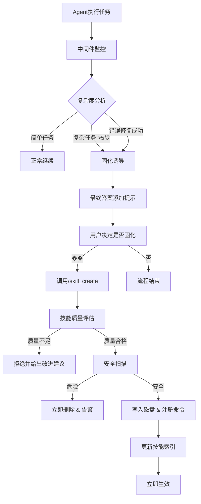

# AIOps Skills 自学习系统设计 (v2.0 - 修正版)

## 概述

本文档基于评审意见修正了原设计方案，重点优化了架构复杂度、安全设计和实施可行性。主要修改包括：简化目录结构、优化技能模型设计、增强AIOps特定安全规则、简化LangGraph集成、添加技能质量评估机制。

## 主要修改摘要

### 1. 架构简化
- **目录结构**：从复杂多层结构简化为扁平结构
- **技能模型**：从继承改为组合模式，保持向后兼容
- **LangGraph集成**：从状态扩展改为中间件模式，降低耦合

### 2. 安全增强
- **AIOps特定规则**：添加监控数据保护、配置防篡改等专用规则
- **动态沙箱**：高风险技能在隔离环境执行
- **质量门禁**：技能质量评估防止低质量技能入库

### 3. 实施优化
- **MVP聚焦**：第一阶段聚焦核心功能，7天完成
- **渐进式扩展**：分阶段添加高级功能
- **风险控制**：详细的风险缓解措施

## 1. 现状分析（保持不变）

### 1.1 AIOps 项目现有 skills 系统
- **技能模型**：`SkillDefinition`、`SkillCategory`、`SkillRiskLevel` 等数据模型已完备
- **技能注册表**：`SkillRegistry` 提供基本的注册和查询功能
- **技能发现服务**：`SkillDiscoveryService` 支持按查询和标签发现技能
- **技能库**：`skills_lib/` 目录包含四大类技能（监控、日志、故障、安全）
- **API/CLI**：提供 `skill_api.py` 和 `skill_cli.py` 管理接口

### 1.2 现有系统局限性
1. **静态技能库**：技能需硬编码定义，无法动态生成
2. **无自学习能力**：Agent 无法从成功经验中固化新技能
3. **无安全管理**：缺乏技能执行安全扫描和权限控制
4. **无渐进式披露**：所有技能一次性加载，无上下文感知
5. **无技能版本管理**：不支持技能更新和回滚

## 2. Hermes Agent Skills 系统分析（保持不变）

### 2.1 核心优势
1. **技能固化（Solidification）**：Agent 可将成功经验转化为持久化技能
2. **安全扫描（Skills Guard）**：写入后立即扫描，拦截危险代码
3. **渐进式披露**：仅加载相关技能内容，优化上下文使用
4. **动态命令注册**：自动扫描技能目录注册为斜杠命令
5. **闭环学习**：系统诱导 + Agent 自主决策的技能生成

### 2.2 关键组件
1. **skill_manager_tool.py**：技能 CRUD 操作，支持原子写入
2. **skill_commands.py**：技能命令扫描和构建
3. **skills_guard.py**：100+ 威胁模式安全扫描
4. **AGENTS.md**：系统提示词，包含技能索引和固化指令

## 3. 融合架构设计（修正版）

### 3.1 整体架构（简化版）

```
┌─────────────────────────────────────────────────────────────┐
│                   AIOps Skills 自学习系统                   │
├─────────────────────────────────────────────────────────────┤
│  ┌─────────────────┐  ┌─────────────────┐  ┌─────────────┐  │
│  │   现有技能系统  │  │   Skills自学习  │  │ 安全与审计  │  │
│  │  ┌──────────┐   │  │  ┌──────────┐   │  │  ┌───────┐  │  │
│  │  │ Registry │   │  │  │ Manager  │   │  │  │ Guard │  │  │
│  │  └──────────┘   │  │  └──────────┘   │  │  └───────┘  │  │
│  │  ┌──────────┐   │  │  ┌──────────┐   │  │  ┌───────┐  │  │
│  │  │Discovery │   │  │  │ Commands │   │  │  │Quality│  │  │
│  │  └──────────┘   │  │  └──────────┘   │  │  └───────┘  │  │
│  │  ┌──────────┐   │  │  ┌──────────┐   │  │  ┌───────┐  │  │
│  │  │Library   │   │  │  │  Sandbox │   │  │  │ Audit │  │  │
│  │  └──────────┘   │  │  └──────────┘   │  │  └───────┘  │  │
│  └─────────────────┘  └─────────────────┘  └─────────────┘  │
│                                                              │
│  ┌──────────────────────────────────────────────────────┐   │
│  │              LangGraph Agent 中间件集成              │   │
│  │  ┌──────────────────────────────────────────────┐   │   │
│  │  │          Skill Integration Middleware        │   │   │
│  │  └──────────────────────────────────────────────┘   │   │
│  └──────────────────────────────────────────────────────┘   │
└─────────────────────────────────────────────────────────────┘
```

### 3.2 核心模块设计（修正版）

#### 3.2.1 简化目录结构

```bash
# 简化后的目录结构（扁平化）
~/.aiops/
├── skills/                    # 用户技能存储（扁平结构）
│   ├── monitoring-diagnose-high-cpu/
│   │   ├── SKILL.md          # 必需：主技能文件（含YAML frontmatter）
│   │   ├── README.md         # 可选：详细说明
│   │   ├── examples/         # 可选：使用示例
│   │   └── config.yaml       # 可选：技能配置
│   ├── diagnosis-fix-memory-leak/
│   │   └── SKILL.md
│   └── .index.json           # 自动生成的技能索引（含质量评分）
├── cache/                    # 技能缓存
│   └── commands.json        # 命令注册缓存
└── logs/                    # 技能执行日志
    ├── skill_execution.log
    └── security_scan.log

# 技能ID生成规则：category-name-slug
# 示例：monitoring-diagnose-high-cpu, diagnosis-fix-memory-leak
```

#### 3.2.2 Skill Manager（优化版）

```python
class SkillManager:
    """技能管理工具，支持动态技能创建和更新（简化版）"""

    def __init__(self, base_dir: Path = SKILLS_HOME):
        self.base_dir = base_dir
        self.skills_dir = base_dir / "skills"
        self.skills_dir.mkdir(parents=True, exist_ok=True)
        self.quality_evaluator = SkillQualityEvaluator()
        self.security_guard = SkillsGuard()

    def create_skill(self, name: str, content: str, category: str, metadata: Dict[str, Any]) -> UserSkill:
        """创建新技能（固化）- 简化流程"""
        # 1. 生成技能ID和目录
        skill_id = f"{category}-{self._slugify(name)}"
        skill_dir = self.skills_dir / skill_id

        # 2. 验证技能名称和目录不存在
        self._validate_new_skill(skill_id, skill_dir)

        # 3. 构建完整技能内容（添加YAML frontmatter）
        full_content = self._build_skill_content(name, content, category, metadata)

        # 4. 质量评估（门禁）
        quality_score = self.quality_evaluator.evaluate(full_content)
        if quality_score.overall < QUALITY_THRESHOLD:
            raise SkillQualityError(f"技能质量评分不足: {quality_score.overall:.2f}")

        # 5. 原子写入
        self._atomic_write(skill_dir / "SKILL.md", full_content)

        # 6. 安全扫描（拦截危险内容）
        scan_result = self.security_guard.scan_skill(skill_dir)
        if scan_result.risk_level == "dangerous":
            shutil.rmtree(skill_dir)
            raise SecurityBlockedError(f"技能包含危险内容: {scan_result.summary}")

        # 7. 构建用户技能对象
        user_skill = UserSkill(
            skill_id=skill_id,
            definition=self._create_skill_definition(skill_id, name, category, metadata),
            metadata=UserSkillMetadata(
                file_path=skill_dir / "SKILL.md",
                created_by=metadata.get("author", "unknown"),
                created_at=datetime.now(),
                quality_score=quality_score,
                security_scan=scan_result
            )
        )

        # 8. 更新索引
        self._update_skill_index(user_skill)

        return user_skill

    def _validate_new_skill(self, skill_id: str, skill_dir: Path):
        """验证新技能"""
        if skill_dir.exists():
            raise SkillExistsError(f"技能已存在: {skill_id}")
        if not VALID_SKILL_ID_PATTERN.match(skill_id):
            raise ValidationError(f"技能ID格式无效: {skill_id}")

    def _build_skill_content(self, name: str, content: str, category: str, metadata: Dict) -> str:
        """构建完整技能内容"""
        frontmatter = {
            "name": name,
            "description": metadata.get("description", ""),
            "category": category,
            "version": "1.0.0",
            "author": metadata.get("author", "AIOps Agent"),
            "created_at": datetime.now().isoformat(),
            "risk_level": metadata.get("risk_level", "medium"),
            "tags": metadata.get("tags", []),
        }

        # 转换为YAML frontmatter格式
        yaml_content = yaml.dump(frontmatter, allow_unicode=True)
        return f"---\n{yaml_content}---\n\n{content}"
```

#### 3.2.3 Skills Guard（增强版）

```python
class SkillsGuard:
    """技能安全扫描器（增强AIOps特定规则）"""

    # 基础威胁模式（来自Hermes Agent）
    BASE_PATTERNS = [
        # 数据外泄
        (r'curl.*\$ENV', 'dangerous', "可能泄露环境变量"),
        (r'wget.*\$ENV', 'dangerous', "可能泄露环境变量"),
        # 破坏性命令
        (r'rm\s+-rf\s+/', 'dangerous', "删除根目录"),
        (r'mkfs\.', 'dangerous', "格式化文件系统"),
        # 持久化后门
        (r'echo.*>>\s*~/(\.bashrc|\.zshrc)', 'dangerous', "修改Shell配置文件"),
    ]

    # AIOps特定威胁模式（新增）
    AIOPS_SPECIFIC_PATTERNS = [
        # 监控数据操作
        (r'(echo|cat).*(\/var\/lib\/(prometheus|victoriametrics)|\/var\/log\/)', 'dangerous', "可能污染监控数据或日志"),

        # 服务操作（缺少确认或监控）
        (r'systemctl\s+(stop|restart)\s+(prometheus|victoriametrics|grafana|alertmanager)', 'caution', "停止关键监控服务"),
        (r'kill\s+-\d+\s+\d+', 'caution', "强制终止进程"),

        # 配置修改（直接修改生产配置）
        (r'sed\s+-i.*\.(yaml|yml|json|conf|properties)', 'caution', "直接修改配置文件"),
        (r'echo.*>\s*\/etc\/', 'dangerous', "修改系统配置文件"),

        # 资源测试工具（可能耗尽资源）
        (r'stress(-ng)?\s+--cpu\s+\d+', 'caution', "CPU压力测试"),
        (r'dd\s+if=/dev/zero', 'caution', "磁盘填充测试"),

        # 日志操作（可能伪造日志）
        (r'logger.*(crit|alert|emerg|err|warning)', 'caution', "写入系统日志"),

        # 网络操作（可能影响监控）
        (r'iptables.*DROP', 'caution', "修改防火墙规则"),
        (r'tc\s+qdisc.*delay|loss', 'caution', "修改网络流量"),

        # 容器操作
        (r'docker\s+(rm\s+-f|stop)\s+', 'caution', "强制删除或停止容器"),
        (r'kubectl\s+delete\s+', 'caution', "删除Kubernetes资源"),
    ]

    def __init__(self):
        self.patterns = self.BASE_PATTERNS + self.AIOPS_SPECIFIC_PATTERNS
        self.whitelist = self._load_whitelist()

    def scan_skill(self, skill_dir: Path) -> ScanResult:
        """扫描技能目录"""
        results = []

        for file_path in skill_dir.rglob("*"):
            if file_path.is_file() and file_path.suffix in ['.md', '.py', '.sh', '.yaml', '.yml']:
                try:
                    content = file_path.read_text()

                    # 检查白名单（允许特定模式）
                    if self._is_whitelisted(content):
                        continue

                    # 检查威胁模式
                    for pattern, level, desc in self.patterns:
                        if re.search(pattern, content, re.IGNORECASE):
                            results.append({
                                'file': str(file_path.relative_to(skill_dir)),
                                'level': level,
                                'description': desc,
                                'pattern': pattern,
                                'context': self._extract_context(content, pattern)
                            })
                except UnicodeDecodeError:
                    continue

        return self._calculate_risk_level(results)

    def _is_whitelisted(self, content: str) -> bool:
        """检查是否在白名单中"""
        whitelist_patterns = [
            r'#\s*ALLOWED:\s*.+',  # 注释中的显式允许
            r'systemctl\s+status\s+',  # 仅检查状态
            r'kubectl\s+get\s+',  # 仅获取信息
            r'docker\s+ps\s+',  # 仅列出容器
        ]
        return any(re.search(p, content, re.IGNORECASE) for p in whitelist_patterns)
```

#### 3.2.4 Skill Quality Evaluator（新增）

```python
class SkillQualityEvaluator:
    """技能质量评估器"""

    def evaluate(self, content: str) -> QualityScore:
        """评估技能质量"""
        scores = {
            "completeness": self._check_completeness(content),
            "clarity": self._check_clarity(content),
            "structure": self._check_structure(content),
            "safety": self._check_safety_indicators(content),
            "reusability": self._check_reusability(content),
        }

        # 计算加权总分
        weights = {
            "completeness": 0.3,
            "clarity": 0.25,
            "structure": 0.2,
            "safety": 0.15,
            "reusability": 0.1,
        }

        overall = sum(scores[k] * weights[k] for k in scores)

        return QualityScore(
            overall=overall,
            category_scores=scores,
            recommendations=self._generate_recommendations(scores)
        )

    def _check_completeness(self, content: str) -> float:
        """检查完整性"""
        required_sections = [
            r'^##?\s+概述',
            r'^##?\s+输入参数',
            r'^##?\s+执行步骤',
            r'^##?\s+输出格式',
            r'^##?\s+注意事项',
        ]

        found = sum(1 for pattern in required_sections if re.search(pattern, content, re.MULTILINE))
        return found / len(required_sections)

    def _check_clarity(self, content: str) -> float:
        """检查清晰度"""
        # 检查代码块是否有说明
        code_blocks = re.findall(r'```[a-z]*\n(.*?)\n```', content, re.DOTALL)
        explained_blocks = sum(1 for block in code_blocks if len(block.strip()) > 0)

        # 检查是否有示例
        has_examples = "示例" in content or "example" in content.lower()

        return min(1.0, (explained_blocks / max(len(code_blocks), 1) * 0.7 + (0.3 if has_examples else 0)))

    def _check_structure(self, content: str) -> float:
        """检查结构"""
        lines = content.split('\n')

        # 检查标题层级
        heading_levels = []
        for line in lines:
            if line.startswith('#'):
                level = len(line.split()[0])
                heading_levels.append(level)

        # 检查标题层级是否合理（不超过3级）
        if heading_levels and max(heading_levels) > 4:
            return 0.7

        # 检查段落长度
        long_paragraphs = sum(1 for line in lines if len(line.strip()) > 200)
        if long_paragraphs > 3:
            return 0.8

        return 1.0

    def _check_safety_indicators(self, content: str) -> float:
        """检查安全指示器"""
        safety_indicators = [
            r'需要.*权限',
            r'谨慎执行',
            r'确认.*再执行',
            r'备份.*再操作',
            r'测试环境.*先验证',
        ]

        found = sum(1 for pattern in safety_indicators if re.search(pattern, content))
        return min(1.0, found / 3)  # 至少3个安全指示器为满分

    def _check_reusability(self, content: str) -> float:
        """检查可复用性"""
        # 检查是否有参数化
        has_parameters = "输入参数" in content and "默认" in content

        # 检查是否有条件分支
        has_conditions = any(word in content.lower() for word in ["如果", "当", "若", "else", "if"])

        # 检查是否有错误处理
        has_error_handling = any(word in content.lower() for word in ["错误", "异常", "失败", "error", "exception"])

        indicators = [has_parameters, has_conditions, has_error_handling]
        return sum(indicators) / len(indicators)
```

#### 3.2.5 Skill Commands Manager（优化版）

```python
class SkillCommandsManager:
    """技能命令管理器（简化版）"""

    def __init__(self, skills_dir: Path):
        self.skills_dir = skills_dir
        self.commands_cache = {}
        self._scan_commands()

    def _scan_commands(self):
        """扫描技能目录并注册命令"""
        self.commands_cache.clear()

        for skill_dir in self.skills_dir.iterdir():
            if not skill_dir.is_dir():
                continue

            skill_file = skill_dir / "SKILL.md"
            if not skill_file.exists():
                continue

            try:
                # 读取frontmatter获取基本信息
                content = skill_file.read_text()
                metadata = self._parse_frontmatter(content)

                skill_id = skill_dir.name
                skill_name = metadata.get('name', skill_id)
                description = metadata.get('description', '')
                category = metadata.get('category', 'custom')

                # 生成命令slug
                cmd_slug = self._generate_command_slug(skill_id, skill_name)

                # 缓存命令信息（不立即加载内容）
                self.commands_cache[f"/{cmd_slug}"] = {
                    "skill_id": skill_id,
                    "skill_name": skill_name,
                    "description": description,
                    "category": category,
                    "skill_file": skill_file,
                    "skill_dir": skill_dir,
                    "loaded": False,  # 标记为未加载
                    "content": None,  # 延迟加载
                }

            except Exception as e:
                logger.warning(f"Failed to parse skill {skill_dir}: {e}")

    def get_command_content(self, command: str) -> Optional[str]:
        """获取命令内容（渐进式披露）"""
        cmd_info = self.commands_cache.get(command)
        if not cmd_info:
            return None

        # 延迟加载内容
        if not cmd_info["loaded"]:
            try:
                content = cmd_info["skill_file"].read_text()
                cmd_info["content"] = content
                cmd_info["loaded"] = True
            except Exception as e:
                logger.error(f"Failed to load skill content for {command}: {e}")
                return None

        # 构建响应（限制内容长度）
        return self._format_skill_response(cmd_info)

    def _format_skill_response(self, cmd_info: Dict) -> str:
        """格式化技能响应"""
        skill_name = cmd_info["skill_name"]
        content = cmd_info["content"]

        # 提取关键部分（避免token浪费）
        sections = self._extract_key_sections(content)

        parts = [
            f'[SYSTEM: 用户调用了 "{skill_name}" 技能。相关指令如下：]',
            "",
            *sections,
            "",
            f'[SYSTEM: 请根据以上指令执行操作。如需完整技能内容，请说"显示完整技能"。]'
        ]

        return "\n".join(parts)

    def _extract_key_sections(self, content: str) -> List[str]:
        """提取关键部分"""
        key_sections = []

        # 提取概述、输入、步骤、输出
        section_patterns = [
            (r'^##?\s+概述[^\n]*\n(.*?)(?=\n##?\s+)', "概述"),
            (r'^##?\s+输入参数[^\n]*\n(.*?)(?=\n##?\s+)', "输入参数"),
            (r'^##?\s+执行步骤[^\n]*\n(.*?)(?=\n##?\s+)', "执行步骤（前3步）"),
            (r'^##?\s+输出格式[^\n]*\n(.*?)(?=\n##?\s+)', "输出格式"),
        ]

        for pattern, section_name in section_patterns:
            match = re.search(pattern, content, re.MULTILINE | re.DOTALL)
            if match:
                section_content = match.group(1).strip()
                # 限制长度
                if len(section_content) > 500:
                    section_content = section_content[:500] + "..."
                key_sections.append(f"### {section_name}\n{section_content}")

        return key_sections
```

#### 3.2.6 数据模型优化（组合模式）

```python
# 保持现有SkillDefinition不变（向后兼容）
class SkillDefinition(BaseModel):
    """技能定义模型（现有，保持不变）"""
    id: str
    name: str
    description: str
    version: str = "1.0.0"
    category: SkillCategory
    # ... 其他现有字段

# 新增：用户技能元数据（磁盘相关）
class UserSkillMetadata(BaseModel):
    """用户技能磁盘元数据"""
    skill_id: str  # 关联到SkillDefinition.id
    file_path: Path
    created_by: str
    created_at: datetime
    updated_at: datetime
    quality_score: Optional[QualityScore] = None
    security_scan: Optional[ScanResult] = None
    execution_stats: Dict[str, Any] = Field(default_factory=dict)
    version: str = "1.0.0"
    tags: List[str] = Field(default_factory=list)

# 新增：用户技能组合对象
class UserSkill:
    """用户技能组合对象（组合而非继承）"""

    def __init__(self, skill_id: str, definition: SkillDefinition, metadata: UserSkillMetadata):
        self.skill_id = skill_id
        self.definition = definition  # 引用现有技能定义
        self.metadata = metadata      # 用户技能特有元数据

    @property
    def id(self) -> str:
        return self.definition.id

    @property
    def name(self) -> str:
        return self.definition.name

    @property
    def category(self) -> SkillCategory:
        return self.definition.category

    @property
    def risk_level(self) -> SkillRiskLevel:
        # 结合���义的风险等级和安全扫描结果
        if self.metadata.security_scan and self.metadata.security_scan.risk_level == "dangerous":
            return SkillRiskLevel.CRITICAL
        return self.definition.risk_level

    def to_dict(self) -> Dict[str, Any]:
        """转换为字典（兼容现有系统）"""
        base_dict = self.definition.model_dump()
        base_dict.update({
            "skill_type": "user_created",
            "file_path": str(self.metadata.file_path),
            "created_by": self.metadata.created_by,
            "created_at": self.metadata.created_at.isoformat(),
            "quality_score": self.metadata.quality_score.dict() if self.metadata.quality_score else None,
            "security_scan": self.metadata.security_scan.dict() if self.metadata.security_scan else None,
        })
        return base_dict

# 向后兼容的注册表
class BackwardCompatibleRegistry(SkillRegistry):
    """向后兼容的技能注册表"""

    def __init__(self):
        super().__init__()
        self.user_skills: Dict[str, UserSkill] = {}
        self.skill_manager = SkillManager()

    def register_user_skill(self, user_skill: UserSkill):
        """注册用户技能"""
        self.user_skills[user_skill.skill_id] = user_skill
        # 同时注册到父类注册表（保持兼容）
        super().register(user_skill.definition)

    def discover_skills(self, query: str, **kwargs) -> List[SkillDefinition]:
        """统一发现接口"""
        results = []

        # 1. 从内置技能库发现
        builtin_results = super().discover_skills(query, **kwargs)
        results.extend(builtin_results)

        # 2. 从用户技能库发现（可选）
        if kwargs.get('include_user_skills', True):
            for user_skill in self.user_skills.values():
                if self._matches_query(user_skill, query, kwargs):
                    results.append(user_skill.definition)

        # 3. 去重和排序（按相关性）
        return self._deduplicate_and_sort(results, query)

    def get_skill_with_metadata(self, skill_id: str) -> Optional[UserSkill]:
        """获取技能及元数据"""
        if skill_id in self.user_skills:
            return self.user_skills[skill_id]

        # 回退到内置技能
        skill_def = self.get(skill_id)
        if skill_def:
            return UserSkill(
                skill_id=skill_id,
                definition=skill_def,
                metadata=UserSkillMetadata(
                    skill_id=skill_id,
                    file_path=Path("<builtin>"),
                    created_by="system",
                    created_at=datetime.now(),
                    updated_at=datetime.now()
                )
            )

        return None
```

### 3.3 LangGraph Agent 集成（简化版）

#### 3.3.1 中间件模式（替代状态扩展）

```python
def skill_integration_middleware(state: RouterState) -> RouterState:
    """
    技能集成中间件
    不修改核心状态，通过附加上下文实现集成
    """

    # 1. 检测技能命令
    command_manager = get_skill_commands_manager()
    invoked_command = None

    for cmd in command_manager.list_commands():
        if state["query"].startswith(cmd):
            invoked_command = cmd
            break

    if not invoked_command:
        return state  # 无技能命令，直接返回

    # 2. 获取技能内容（渐进式披露）
    skill_content = command_manager.get_command_content(invoked_command)
    if not skill_content:
        # 技能加载失败，添加错误信息到上下文
        return {
            **state,
            "context": {
                **state.get("context", {}),
                "skill_error": f"技能加载失败: {invoked_command}"
            }
        }

    # 3. 构建技能执行上下文（不修改核心状态）
    skill_context = {
        "skill_invoked": True,
        "skill_command": invoked_command,
        "skill_content": skill_content,
        "original_query": state["query"],
        "user_instruction": state["query"].replace(invoked_command, "").strip()
    }

    # 4. 更新查询以包含技能内容
    # 注意：这里不修改state的原始结构，而是创建新查询
    enhanced_query = f"{skill_content}\n\n用户指令: {skill_context['user_instruction']}"

    return {
        **state,
        "query": enhanced_query,  # 替换查询内容
        "context": {
            **state.get("context", {}),
            **skill_context
        }
    }

def skill_solidification_middleware(state: RouterState, next_state: RouterState) -> RouterState:
    """
    技能固化中间件（后处理）
    监控任务复杂度，在适当时机诱导技能固化
    """

    # 仅在有最终答案时触发
    if "final_answer" not in next_state:
        return next_state

    # 分析任务复杂度
    task_complexity = analyze_task_complexity(state, next_state)

    # 触发条件：复杂任务或错误修复
    should_nudge = (
        task_complexity.get("step_count", 0) >= 5 or
        ("error" in state["query"].lower() and "success" in next_state["final_answer"].lower())
    )

    if not should_nudge:
        return next_state

    # 添加固化诱导到最终答案
    nudge_message = (
        "\n\n---\n"
        "[系统提示: 这个任务涉及多个步骤，可能是一个可复用的工作流。"
        "考虑使用 `/skill_create` 命令将其保存为技能。]"
    )

    return {
        **next_state,
        "final_answer": next_state["final_answer"] + nudge_message,
        "context": {
            **next_state.get("context", {}),
            "should_solidify": True,
            "solidification_candidate": {
                "workflow": task_complexity.get("workflow_steps", []),
                "complexity_score": task_complexity.get("complexity_score", 0)
            }
        }
    }
```

#### 3.3.2 工作流集成示例

```python
# 在现有工作流中集成中间件
def build_enhanced_workflow():
    """构建增强的工作流（技能集成）"""

    # 现有工作流构建
    workflow = build_default_workflow()

    # 包装工作流以添加中间件
    @workflow.compile()
    def enhanced_invoke(input_state: Dict):
        # 1. 技能命令中间件（前置）
        state_with_skills = skill_integration_middleware(input_state)

        # 2. 执行原始工作流
        result_state = workflow.invoke(state_with_skills)

        # 3. 技能固化中间件（后置）
        final_state = skill_solidification_middleware(input_state, result_state)

        return final_state

    return enhanced_invoke

# 替代方案：使用LangGraph的装饰器
def with_skill_middleware(node_func):
    """技能中间件装饰器"""
    @wraps(node_func)
    def wrapper(state: RouterState):
        # 前置处理：技能命令检测
        processed_state = skill_integration_middleware(state)

        # 执行原始节点
        result = node_func(processed_state)

        # 后置处理：技能固化诱导
        if node_func.__name__ == "final_answer_node":
            result = skill_solidification_middleware(state, result)

        return result
    return wrapper

# 使用装饰器包装关键节点
@with_skill_middleware
def enhanced_router_node(state: RouterState):
    """增强的路由节点"""
    return original_router_node(state)
```

### 3.4 技能固化流程（优化版）

#### 3.4.1 简化固化流程



#### 3.4.2 技能质量门禁

```
技能创建流程的质量检查点：

1. 格式检查 (必须通过)
   - 有效的YAML frontmatter
   - 必需字段: name, description, category
   - 技能ID格式正确

2. 质量评估 (评分 > 0.7)
   - 完整性: 包含所有必需章节
   - 清晰度: 代码有说明，有示例
   - 结构: 标题层级合理，段落适中
   - 安全性: 包含安全注意事项
   - 可复用性: 参数化，有条件处理

3. 安全扫描 (必须通过)
   - 无危险操作 (dangerous级别)
   - 谨慎操作有警告 (caution级别)
   - AIOps特定风险检查

4. 重复检查 (可选)
   - 相似技能检测
   - 版本冲突检查
```

## 4. 实施计划（修正版）

### 4.1 第一阶段：最小可行产品 MVP (7天)

#### 任务1.1：基础模型和目录结构 (1.5天)
- **目标**：建立简化的数据模型和目录结构
- **子任务**：
  1. 创建 `UserSkillMetadata` 模型 (0.5天)
  2. 创建 `UserSkill` 组合类 (0.5天)
  3. 实现简化目录结构 (0.5天)
- **输出**：`aiops/skills/user_models.py`, `aiops/skills/storage.py`

#### 任务1.2：核心SkillManager实现 (2天)
- **目标**：实现技能创建核心功能
- **子任务**：
  1. 实现 `create_skill()` 基础流程 (1天)
  2. 实现原子写入和基础验证 (0.5天)
  3. 集成质量评估门禁 (0.5天)
- **输出**：`aiops/skills/manager.py`, `aiops/skills/quality.py`

#### 任务1.3：增强安全扫描 (1.5天)
- **目标**：实现AIOps增强的安全扫描
- **子任务**：
  1. 移植基础威胁模式 (0.5天)
  2. 添加AIOps特定规则 (0.5天)
  3. 实现白名单机制 (0.5天)
- **输出**：`aiops/skills/guard.py`, `aiops/skills/security_patterns.py`

#### 任务1.4：命令管理器MVP (1天)
- **目标**：实现基本的命令扫描和注册
- **子任务**：
  1. 实现命令扫描和缓存 (0.5天)
  2. 实现渐进式内容加载 (0.5天)
- **输出**：`aiops/skills/commands.py`

#### 任务1.5：集成测试和验证 (1天)
- **目标**：验证MVP功能完整性
- **子任务**：
  1. 端到端技能创建测试 (0.5天)
  2. 安全扫描验证测试 (0.5天)
- **输出**：测试用例和验证报告

### 4.2 第二阶段：Agent集成和API扩展 (5天)

#### 任务2.1：LangGraph中间件集成 (2天)
- **目标**：实现不侵入的Agent集成
- **子任务**：
  1. 实现技能命令中间件 (1天)
  2. 实现技能固化中间件 (1天)
- **输出**：`aiops/workflows/skill_middleware.py`

#### 任务2.2：API和CLI扩展 (1.5天)
- **目标**：扩展管理接口
- **子任务**：
  1. 扩展技能API端点 (1天)
  2. 更新CLI命令 (0.5天)
- **输出**：`aiops/api/skill_api.py`扩展, `aiops/cli/skill_cli.py`扩展

#### 任务2.3：系统提示词和文档 (1.5天)
- **目标**：更新用户指引
- **子任务**：
  1. 更新系统提示词 (0.5天)
  2. 编写技能创建指南 (0.5天)
  3. 创建技能模板 (0.5天)
- **输出**：`docs/skill_authoring_guide.md`, 技能模板文件

### 4.3 第三阶段：高级功能 (6天)

#### 任务3.1：技能版本管理 (2天)
- **目标**：实现版本控制和冲突解决
- **输出**：`aiops/skills/versioning.py`

#### 任务3.2：性能监控和统计 (2天)
- **目标**：实现技能使用统计和质量跟踪
- **输出**：`aiops/skills/monitoring.py`, `aiops/skills/metrics.py`

#### 任务3.3：动态沙箱执行 (2天)
- **目标**：实现高风险技能的安全执行环境
- **输出**：`aiops/skills/sandbox.py`

### 4.4 第四阶段：测试和部署 (4天)

#### 任务4.1：全面测试 (2天)
- **目标**：功能、性能、安全测试
- **输出**：测试报告和性能基准

#### 任务4.2：生产部署准备 (2天)
- **目标**：部署配置和监控设置
- **输出**：部署脚本、监控配置

## 5. 风险与缓解措施（增强版）

### 5.1 技术风险

| 风险 | 可能性 | 影响 | 缓解措施 |
|------|--------|------|----------|
| **技能模型兼容性** | 中 | 高 | 使用组合模式，保持现有API不变，提供适配器 |
| **安全扫描性能** | 高 | 中 | 增量扫描、缓存结果、异步扫描 |
| **技能质量泛滥** | 高 | 中 | 质量门禁、定期清理、用户评分系统 |
| **中间件性能影响** | 低 | 低 | 懒加载、缓存、性能监控 |

### 5.2 AIOps特定风险

| 风险 | 缓解措施 |
|------|----------|
| **监控数据污染** | 加强/var/lib/prometheus等路径的写保护 |
| **服务误操作** | 识别systemctl stop等命令，添加确认检查 |
| **配置篡改** | 检测直接配置文件修改，推荐配置管理工具 |
| **资源耗尽** | 识别stress、dd等资源测试工具，添加资源限制 |

### 5.3 实施风险

| 风险 | 缓解措施 |
|------|----------|
| **开发时间超期** | 聚焦MVP，分阶段交付，每周评审进度 |
| **用户接受度低** | 提供详细示例和模板，收集早期反馈 |
| **技能库初始空** | 提供内置技能迁移工具，创建初始技能库 |

## 6. 成功度量标准（更新版）

### 6.1 第一阶段成功标准 (MVP)
- [ ] 技能创建成功率 > 95%
- [ ] 安全扫描误报率 < 10%
- [ ] 端到端流程验证通过
- [ ] 核心API/CLI功能完整

### 6.2 第二阶段成功标准
- [ ] Agent集成无性能影响 (< 5% 延迟增加)
- [ ] 用户技能创建数 > 10个/周
- [ ] 技能平均质量评分 > 0.7
- [ ] 无安全漏洞漏报

### 6.3 长期成功标准
- [ ] 活跃用户技能使用率 > 30%
- [ ] 技能平均复用次数 > 3次
- [ ] 问题解决时间减少 > 20%
- [ ] 用户满意度评分 > 4/5

## 7. 后续演进路线

### 7.1 短期演进 (1-2个月)
1. **技能市场功能**：技能共享和发现
2. **协同编辑**：团队协作开发技能
3. **自动化测试**：技能正确性自动验证

### 7.2 中期演进 (3-6个月)
1. **智能推荐**：基于上下文推荐技能
2. **质量自动优化**：基于反馈自动改进技能
3. **技能知识图谱**：构建技能关联关系

### 7.3 长期演进 (6-12个月)
1. **跨系统兼容**：支持OpenAI Functions等标准
2. **自动技能生成**：从文档/代码生成技能
3. **自适应学习**：基于执行结果自我优化

---

## 总结

### 主要改进点

1. **架构简化**：扁平目录结构、组合数据模型、中间件集成模式
2. **安全增强**：AIOps特定规则、质量门禁、动态沙箱
3. **实施优化**：MVP聚焦、分阶段交付、详细风险控制
4. **兼容性保障**：保持现有API不变，渐进式迁移

### 实施建议

1. **立即开始**：按照修正的Phase 1计划启动开发
2. **每周评审**：检查进度，调整优先级
3. **早期反馈**：尽快让用户体验MVP，收集反馈
4. **安全第一**：宁可误报不可漏报，逐步优化规则

### 关键决策点

1. **技能质量门槛**：初始设置为0.7，根据实际情况调整
2. **安全扫描严格度**：初始从严，逐步建立白名单
3. **性能权衡**：功能完整性优先，性能优化后续进行

---

*设计方案版本：2.0*
*修订日期：2026-03-12*
*主要修订：架构简化、安全增强、实施优化*
*基于评审意见修正*